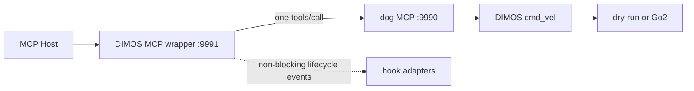

# 项目 Context

## 项目范围

本仓库以 Pi 为基础，并在 `integrations/` 下维护面向机器人的 Agent 集成。当前硬件探索目标是使用 [DIMOS](https://github.com/dimensionalOS/dimos) 将 Agent 的 MCP 工具调用安全地连接到机器狗。

根 `CONTEXT.md` 是该仓库的单一领域 context。变更机器人、MCP 或 Agent 集成前，应先阅读本文件；如存在相关 `docs/adr/` 决策，也必须一并阅读。

## 组件与术语

| 名称 | 位置 | 职责 |
| --- | --- | --- |
| 上游机器狗 MCP | `integrations/dimos-dog-mcp` | DIMOS 原生 MCP 服务，暴露 `move_forward`、`move_backward`、`stop_motion`、`motion_status`，并通过 `cmd_vel: Twist` 连接 dry-run 或 Unitree Go2。 |
| MCP 薄包装器 | `integrations/dimos-mcp-wrapper` | 独立 DIMOS MCP 服务，转发同名工具到上游 MCP，并发出生命周期 hook。 |
| 上游 MCP | 默认 `http://127.0.0.1:9990/mcp` | 真正执行机器狗命令的服务。 |
| 包装器 MCP | 默认 `http://127.0.0.1:9991/mcp` | MCP Host 应连接的服务。 |
| 生命周期 hook | `McpCallHook` | 对转发事件做最佳努力处理的旁路；不是权限检查器，也不是命令改写器。 |

## 不变量

1. 机器狗动作的参数验证、并发控制、零速度结束和 dry-run/Go2 选择属于上游机器狗 MCP；包装器不得复制或绕过这些逻辑。
2. 每个包装器工具调用最多向上游发送一次 `tools/call` 请求。不得自动重试运动命令。
3. 包装器必须原样转发已公开工具的名称和参数，并返回上游的文本结果或清晰的上游错误。
4. `stop_motion` 优先于 hook：请求必须立刻转发，hook 不能让它等待、重试或被吞掉。
5. hook 事件为 `before_call`、`after_success`、`after_error`、`finally`。事件按 FIFO 入队，但 hook 不在 MCP 调用路径上执行，因此 `before_call` 不是前置拦截器。
6. hook 失败只能记录日志，不能改变上游请求、返回值或错误。hook 的投递是最佳努力，不保证在包装器进程退出时完成。
7. 当前没有确定“发送其他指令”的协议。不得先行增加假设性的 `send_instruction` MCP 工具、网络协议或硬件 SDK；确定协议后，以具体 hook/适配器接入。

## 运行约束

- DIMOS `0.0.14b1` 要求 Python 3.10 至 3.12；本开发机的 Python 3.14 只能运行不依赖 DIMOS 的纯单元测试。
- 上游机器狗 MCP 默认 dry-run。实机 Go2 操作仍需显式设置上游的 `DIMOS_DOG_MCP_MODE=go2`，并满足场地隔离、独立急停和官方网络预检。
- 包装器默认请求超时为 10 秒，配置通过 `DIMOS_MCP_WRAPPER_*` 环境变量提供。它不直接打开硬件连接。

## 测试 seam

- 上游 MCP seam：标准 JSON-RPC `tools/call` 请求、单次调用、文本结果与错误传递。
- hook seam：hook 非阻塞、只读、异常隔离。
- DIMOS MCP seam：在兼容环境中，`tools/list` 发现四个包装器工具。

这些名称应直接用于后续的实现、测试、Issue 和设计讨论，避免将包装器误称为机器人控制器或将 hook 误称为同步拦截器。
