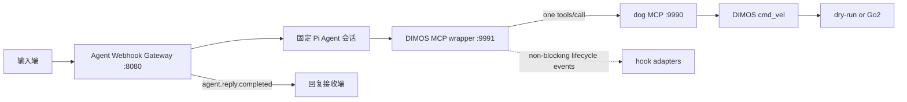

# 项目 Context

## 项目范围

本仓库以 Pi 为基础，并在 `integrations/` 下维护面向机器人的 Agent 集成。当前硬件探索目标是使用 [DIMOS](https://github.com/dimensionalOS/dimos) 将 Agent 的 MCP 工具调用安全地连接到机器狗。

根 `CONTEXT.md` 是该仓库的单一领域 context。变更机器人、MCP 或 Agent 集成前，应先阅读本文件；如存在相关 `docs/adr/` 决策，也必须一并阅读。

## 对外使用文档

根 [USAGE.md](USAGE.md) 是框架使用者的公开使用与开发指南，覆盖上层 MCP Host 接入、下层机器狗接入、配置、hook 和扩展流程。

每次新增、删除或改变用户可见功能时，必须同步更新 `USAGE.md`。工具、参数、端点、环境变量、硬件适配方式、hook 契约和运行前置条件均属于用户可见功能；若变更还影响本文件中的术语、架构边界或安全不变量，也必须同时更新 `CONTEXT.md`。

## 组件与术语

| 名称 | 位置 | 职责 |
| --- | --- | --- |
| 上游机器狗 MCP | `integrations/dimos-dog-mcp` | DIMOS 原生 MCP 服务，暴露 `move_forward`、`move_backward`、`stop_motion`、`motion_status`，并通过 `cmd_vel: Twist` 连接 dry-run 或 Unitree Go2。 |
| MCP 薄包装器 | `integrations/dimos-mcp-wrapper` | 独立 DIMOS MCP 服务，转发同名工具到上游 MCP，并发出生命周期 hook。 |
| 上游 MCP | 默认 `http://127.0.0.1:9990/mcp` | 真正执行机器狗命令的服务。 |
| 包装器 MCP | 默认 `http://127.0.0.1:9991/mcp` | MCP Host 应连接的服务。 |
| 生命周期 hook | `McpCallHook` | 对转发事件做最佳努力处理的旁路；不是权限检查器，也不是命令改写器。 |
| 外部指令事件 | 输入端契约 | 带稳定 `instruction_id` 的已确认用户请求文本；重试时 ID 不变，在投递前不等同于 Agent 会话消息。避免称其为 MCP 调用或机器狗命令。 |
| 语音停止口令 | 输入网关快速路径 | 规范化后精确等于“停”或“stop”的外部指令事件。它绕过 Agent 会话并触发 `stop_motion`，但不等同于独立物理急停。 |
| 估算距离运动 | Agent 运动语义 | 用户以距离或距离加时长表达的运动请求。方向可选且默认向前；Agent 将其换算为经部署标定的有限时长速度指令。它是距离估算，不是定位或到达保证。 |
| 输入网关 | `integrations/agent-webhook-gateway` | 外部指令事件进入 Agent 前的唯一受理边界。避免称其为 MCP Server 或机器狗控制器。 |
| Agent 会话 | 部署内运行时 | 当前 MVP 中一个部署唯一且固定的 Agent 上下文；外部调用方不能指定或切换它。避免称其为外部会话路由。 |
| Agent 回复事件 | 回复端契约 | 与 `instruction_id` 关联、带稳定 `reply_id` 的用户可见最终文本。Agent 无法完成时，文本固定替换为用户可见的回退语；避免称其为 MCP 结果或模型 token 流。 |
| 输出投递器 | `integrations/agent-webhook-gateway` | 从持久化 outbox 向回复接收端的回调地址投递 Agent 回复事件。避免称其为 MCP hook。 |

## 不变量

1. 机器狗动作的参数验证、并发控制、零速度结束和 dry-run/Go2 选择属于上游机器狗 MCP；包装器不得复制或绕过这些逻辑。
2. 每个包装器工具调用最多向上游发送一次 `tools/call` 请求。不得自动重试运动命令。
3. 包装器必须原样转发已公开工具的名称和参数，并返回上游的文本结果或清晰的上游错误。
4. `stop_motion` 优先于 hook：请求必须立刻转发，hook 不能让它等待、重试或被吞掉。
5. hook 事件为 `before_call`、`after_success`、`after_error`、`finally`。事件按 FIFO 入队，但 hook 不在 MCP 调用路径上执行，因此 `before_call` 不是前置拦截器。
6. hook 失败只能记录日志，不能改变上游请求、返回值或错误。hook 的投递是最佳努力，不保证在包装器进程退出时完成。
7. 当前没有确定“发送其他指令”的协议。不得先行增加假设性的 `send_instruction` MCP 工具、网络协议或硬件 SDK；确定协议后，以具体 hook/适配器接入。
8. 输入网关仅在外部指令事件持久化后返回 `202 Accepted`；该确认不表示 Agent 已处理、模型已响应或任何机器狗动作已执行。
9. 输出投递器必须先持久化 Agent 回复事件，再发起回调。回调失败只能重试投递，不得重新运行 Agent 或重复任何机器狗工具调用。
10. 每个 Agent 回复事件只交付完整的最终用户可见文本。Agent 的系统提示词必须明确：该最终文本会直接发给用户，因此必须面向用户表达，不得将内部执行细节、工具调用或推理当作回复。
11. 当前 MVP 每个部署只有一个固定 Agent 会话；输入网关不得接受或信任外部传入的 Agent 或会话路由标识。
12. 当前 MVP 的入站和出站 Webhook 不提供身份校验、签名或重放防护；它们只能被视为受信任环境内的临时集成边界，不得被描述为安全的公网接口。
13. 除语音停止口令外，输入网关只承载异步的自然语言事件，不能作为实时控制或紧急停止路径；语音停止口令也不能替代独立、直接的物理安全路径。
14. 固定 Agent 会话的外部指令事件按持久化受理顺序串行处理；一个事件达到终态后才开始下一事件，以保障 `instruction_id` 与 `reply_id` 的一对一关联。
15. Agent 无法产出最终回复时，输出投递器仍发送普通的 `agent.reply.completed` 事件，并将 `text` 固定为“暂时无法完成此请求，请稍后重试。”；不得向下层暴露失败事件、原始异常、工具错误或部分模型文本。
16. 语音停止口令在持久化与幂等登记后必须绕过 Agent 会话队列，经包装器单次调用 `stop_motion`；任何不精确匹配的文本不得进入该快速路径。
17. 语音停止口令的 `stop_motion` 调用被 MCP 接受后，输出投递器必须以普通的 `agent.reply.completed` 事件回复“已发送停止指令。”；调用失败时则回复既定的通用失败文本，不得声称机器狗已静止。
18. 输入网关信任输入端已将每个 Webhook 确认为完整真实请求；它不采集音频、不做 ASR、唤醒、分段或用户意图判断，并将 `text` 作为不透明文本处理。
19. 可执行的运动请求必须为“速度加时长”“距离加时长”或仅“距离”；方向可选且默认向前。时长或速度脱离其配对参数均不完整。其他可能导致机器狗运动但必要参数不明确的请求，Agent 必须以面向用户的最终文本追问，且不得调用运动工具、套用默认参数或猜测用户意图。
20. 距离加时长的请求必须将距离除以时长换算为正的有限速度；仅距离的请求必须基于部署标定的默认速度换算为正的有限时长。最终回复不得声称机器狗精确移动或到达了该距离。
21. 网关进程恢复时，不得重新运行已进入 `processing` 但未形成 outbox 的事件；应为其持久化既定通用失败回复，以避免机器狗副作用在崩溃恢复后重复执行。

## 运行约束

- DIMOS `0.0.14b1` 要求 Python 3.10 至 3.12；本开发机的 Python 3.14 只能运行不依赖 DIMOS 的纯单元测试。
- 默认 MCP 只安装 `dimos[web]`，即 MCP Server 所需的 FastAPI/Uvicorn 运行时；不得额外启用会引入 Agent、感知和可视化功能集合的 `dimos[base]` 聚合 extra。
- 上游机器狗 MCP 默认 dry-run。实机 Go2 操作仍需显式设置上游的 `DIMOS_DOG_MCP_MODE=go2`，并满足场地隔离、独立急停和官方网络预检。
- 包装器默认请求超时为 10 秒，配置通过 `DIMOS_MCP_WRAPPER_*` 环境变量提供。它不直接打开硬件连接。
- Agent Webhook Gateway 要求 Node.js 22.19 或更高版本，使用 Node 原生 SQLite 持久化 inbox/outbox，并读取既有 Pi Agent 模型与认证配置。

## 测试 seam

- 上游 MCP seam：标准 JSON-RPC `tools/call` 请求、单次调用、文本结果与错误传递。
- hook seam：hook 非阻塞、只读、异常隔离。
- DIMOS MCP seam：在兼容环境中，`tools/list` 发现四个包装器工具。
- 输入 Webhook seam：严格请求 schema、持久化后 `202`、稳定 `instruction_id` 幂等与冲突响应。
- 固定 Agent seam：普通事件按持久化顺序串行处理，系统提示词明确最终输出直接面向用户，四个包装器 MCP 工具保持激活。
- 输出 Webhook seam：完整终态回复、稳定 `reply_id`、失败重投与进程恢复均不得重跑 Agent 或 MCP 工具。
- 停止快速路径 seam：只匹配规范化后的“停”或 `stop`，绕过 Agent 并单次调用 `stop_motion`。

这些名称应直接用于后续的实现、测试、Issue 和设计讨论，避免将包装器误称为机器人控制器或将 hook 误称为同步拦截器。
