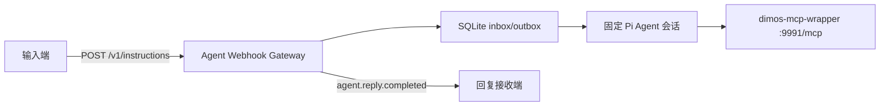

# Agent Webhook Gateway

该服务实现固定 Pi Agent 会话的持久化输入网关和输出投递器。输入端只提交用户文本；Agent 通过 `dimos-mcp-wrapper` 的四个 MCP 工具操作机器狗；回复接收端只收到完整的最终用户可见文本。



## 安装

需要 Node.js 22.19 或更高版本。先确保 `dimos-dog-mcp` 和 `dimos-mcp-wrapper` 已按仓库根目录 `USAGE.md` 启动。

```powershell
Set-Location "C:/absolute/path/to/pi-hackason/components/agent-framework/agent-webhook-gateway"
npm ci --ignore-scripts
npm run build
```

服务使用 Pi Coding Agent 的既有模型与认证配置，默认读取 `~/.pi/agent`。部署前应先用 Pi 完成模型和认证配置。

## 配置与启动

`AGENT_WEBHOOK_REPLY_URL` 是唯一必填环境变量：

```powershell
$env:AGENT_WEBHOOK_REPLY_URL = "http://reply-receiver:9080/agent-replies"
$env:AGENT_WEBHOOK_MCP_URL = "http://127.0.0.1:9991/mcp"
node dist/cli.js
```

默认输入端点为：

```text
POST http://127.0.0.1:8080/v1/instructions
```

| 环境变量 | 默认值 | 说明 |
| --- | --- | --- |
| `AGENT_WEBHOOK_REPLY_URL` | 无 | 回复接收端的部署级 HTTP(S) 回调 URL，必填。 |
| `AGENT_WEBHOOK_HOST` | `127.0.0.1` | 输入网关监听地址。 |
| `AGENT_WEBHOOK_PORT` | `8080` | 输入网关监听端口。 |
| `AGENT_WEBHOOK_DATABASE_PATH` | `<cwd>/data/agent-webhook.sqlite` | 持久化 inbox/outbox 的 SQLite 文件。 |
| `AGENT_WEBHOOK_MCP_URL` | `http://127.0.0.1:9991/mcp` | `dimos-mcp-wrapper` 的 HTTP MCP URL。 |
| `AGENT_WEBHOOK_MCP_TIMEOUT_MS` | `10000` | 单次 MCP 请求超时。运动工具不会自动重试。 |
| `AGENT_WEBHOOK_REPLY_TIMEOUT_MS` | `10000` | 单次回复回调超时。 |
| `AGENT_WEBHOOK_RETRY_BASE_MS` | `1000` | 回复回调失败后的重投等待时间。 |
| `AGENT_WEBHOOK_RETRY_MAX_MS` | `60000` | 回复重投等待时间的上限。 |
| `AGENT_WEBHOOK_AGENT_CWD` | 当前目录 | 固定 Agent 会话的工作目录。 |
| `AGENT_WEBHOOK_AGENT_DIR` | `~/.pi/agent` | Pi 模型、认证和设置目录。 |
| `AGENT_WEBHOOK_SESSION_DIR` | `<cwd>/data/agent-session` | 固定 Agent 会话的持久化目录。 |
| `AGENT_WEBHOOK_DEFAULT_SPEED_MPS` | `0.1` | 用户只给距离时用于估算时长的部署标定速度。 |

当前 MVP 没有身份校验、签名或重放防护，只能部署在受信任网络。

## 行为

- 输入 JSON 只能包含非空的 `instruction_id` 和 `text`。
- 新事件和相同文本的幂等重投返回 `202`；同一 ID 对应不同文本返回 `409`。
- 普通事件按 SQLite 受理顺序串行进入一个固定 Agent 会话。
- “停”或 `stop` 的精确规范化匹配绕过 Agent，单次调用 `stop_motion`。
- Agent 或停止调用失败时仍产生普通回复事件，文本固定为“暂时无法完成此请求，请稍后重试。”。
- outbox 先持久化再回调。回调失败只重投同一 `reply_id`，不会重跑 Agent 或 MCP 工具。
- 进程启动时若发现上次运行中断在 `processing` 状态，会生成固定失败回复而不重跑该事件，避免重复机器狗副作用。

完整 HTTP schema 见 `docs/agent-input-webhook-integration.md`。

## 开发

```powershell
npm test
npm run check
```

主要扩展边界：

- 新的用户文本运行时实现 `UserTextAgent`；
- 新的 MCP 传输实现 `McpToolCaller`；
- 新的回复传输实现 `ReplyEventDelivery`；
- Webhook schema、稳定 ID、固定会话串行语义和 outbox 不得由适配器改变。
