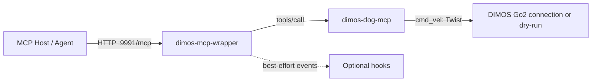

# DIMOS MCP 薄包装器

该组件本身是一个 DIMOS 原生 MCP 服务。它不控制机器狗，也不复制运动逻辑；它把机器狗 MCP 工具调用转发给已运行的独立 `components/dimos-mcp`，并在转发路径上发出不会阻塞调用的生命周期 hook。



## 安装与启动

DIMOS `0.0.14b1` 要求 Python 3.10 至 3.12。底层机器应按 `components/dimos-mcp/README.md` 独立启动机器狗 MCP。若同机部署：

```bash
uv venv --python 3.12
source .venv/bin/activate
uv pip install -e /absolute/path/to/pi-hackason/components/dimos-mcp
dimos-dog-mcp
```

再启动包装器。默认上游为 `http://127.0.0.1:9990/mcp`，包装器自身监听 `http://127.0.0.1:9991/mcp`，因此两个服务不会抢占端口。

```bash
uv pip install -e /absolute/path/to/pi-hackason/components/agent-framework/dimos-mcp-wrapper
dimos-mcp-wrapper
```

若包装器运行在另一台上层机器：

```bash
export DIMOS_MCP_WRAPPER_UPSTREAM_URL=http://192.168.66.160:9990/mcp
dimos-mcp-wrapper
```

MCP Host 只连接包装器，例如：

```bash
claude mcp add --transport http --scope project dimos-dog-wrapper http://127.0.0.1:9991/mcp
```

## 工具

包装器暴露与上游同名的四个工具，并将参数不变地转发：

| 工具 | 上游工具 | 说明 |
| --- | --- | --- |
| `move_forward` | `move_forward` | 转发前进速度和持续时间。 |
| `move_backward` | `move_backward` | 转发后退速度和持续时间。 |
| `stop_motion` | `stop_motion` | 立即转发停止，不重试。 |
| `motion_status` | `motion_status` | 转发上游本地运动状态。 |

速度、持续时间、dry-run/Go2 模式和最终零速度停止均由上游 `dimos-dog-mcp` 负责。包装器不连接硬件，也不伪造遥测。

## 配置

| 环境变量 | 默认值 | 作用 |
| --- | --- | --- |
| `DIMOS_MCP_WRAPPER_UPSTREAM_URL` | `http://127.0.0.1:9990/mcp` | 上游 MCP 的完整 HTTP URL。 |
| `DIMOS_MCP_WRAPPER_PORT` | `9991` | 包装器的 DIMOS MCP 监听端口。 |
| `DIMOS_MCP_WRAPPER_TIMEOUT_S` | `10.0` | 单次上游请求的超时秒数。 |

上游请求采用一条标准 JSON-RPC `tools/call` HTTP POST。网络失败、HTTP 失败或 MCP 错误会返回给调用方；包装器不会自动重试运动类命令。

底层参数或互斥错误使用 `{"status":"error","error":"..."}` 文本 envelope。包装器还识别 DIMOS 原生 Server 将意外异常包装成的 `Error running tool '...'` 文本；两类结果都会抛出上游错误并触发 `after_error`，不会触发 `after_success`。

## Hook

`ForwardingService` 通过一个专用 daemon worker 以 FIFO 顺序投递下列事件：

- `before_call`
- `after_success`
- `after_error`
- `finally`

`before_call` 仅表示事件已入队，不是拦截器：上游调用不会等待 hook 执行。hook 无法改写转发参数；hook 抛出的异常只记录日志，不会改变上游请求、结果或错误。尤其是 `stop_motion` 会直接转发，hook 不得延迟或重试它。

要加入一个已确定传输方式的 hook，可由 Python 入口组合：

```python
from dimos_mcp_wrapper.blueprint import build_blueprint
from dimos_mcp_wrapper.hooks import McpCallEvent


class AuditHook:
    def handle(self, event: McpCallEvent) -> None:
        if event.phase == "after_success":
            print(event.call.tool_name)


from dimos.core.coordination.module_coordinator import ModuleCoordinator

ModuleCoordinator.build(build_blueprint(hooks=(AuditHook(),))).loop()
```

当前不提供猜测性的 `send_instruction` 工具。未来确定指令协议后，应实现一个具体 hook 或独立适配器，并继续保持“上游调用一次、hook 最佳努力、停止优先”的约束。

## 测试

```powershell
Set-Location /absolute/path/to/pi-hackason/components/agent-framework/dimos-mcp-wrapper
$env:PYTHONPATH = "$PWD/src"
python -m unittest discover -s tests -v
```

纯单元测试不需要 DIMOS。原生 `tools/list` 集成测试只会在安装 DIMOS 的 Python 3.10 至 3.12 环境运行。
