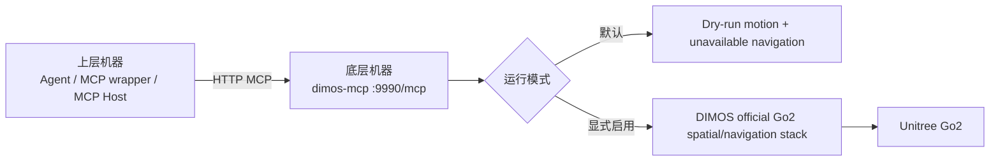

# 独立 DIMOS 机器狗 MCP

`dimos-mcp` 是部署在机器狗侧主机上的独立底层 MCP。它不依赖 Agent Webhook Gateway 或 MCP 包装器运行。它公开 DiMOS `0.0.14b1` 中除 `speak` 外的 20 个官方工具，以及 7 个自研工具；Go2 模式组合官方空间、导航和机器人技能，但不运行模型、Agent 循环或云端 TTS。



## 模块接口

服务固定暴露 27 个工具。完整参数与语义表见根目录 `USAGE.md`：

| 工具 | 参数 | 行为 |
| --- | --- | --- |
| `move_forward` | `speed_mps`、`duration_s` | 按给定速度和时长前进；实机动作结束时发布零速度。 |
| `move_backward` | `speed_mps`、`duration_s` | 按给定速度和时长后退；实机动作结束时发布零速度。 |
| `stop_motion` | 无 | 取消本地运动并立即发布零速度。 |
| `motion_status` | 无 | 返回本地命令执行状态，不是机器狗遥测。 |
| 20 个 DiMOS 官方工具 | 官方 `0.0.14b1` 签名 | 管理、相对移动、设备状态、导航、探索、巡逻、感知与跟随；不包含 `speak`。 |
| `return_to_start` | 无 | 返回本次下层进程捕获的第一帧有效里程计位置。 |
| `start_stroll` | 无 | 随机选择一个局部未知分支，退休其他分支并避免回头补覆盖。 |
| `stop_stroll` | 无 | 停止人类式散步。 |

速度和时长必须是正有限数值。当前不设置硬编码数值上限；dry-run 和 Go2 都使用同一运动状态机并拒绝重叠运动。可预期的参数或互斥错误返回 `{"status":"error","error":"..."}` 文本结果。MCP 请求返回只表示底层命令处理结果，不证明机器狗已经到达目标位置。

除三个官方 MCP 管理工具和四个本地定时运动工具外，其余能力只有 Go2 模式会真实执行。dry-run 中完整工具仍可通过 `tools/list` 发现，但调用会返回包含 `required_mode: "go2"` 的错误。`start_patrol` 是已建图覆盖巡逻；`start_stroll` 是面向未知道路的非覆盖式随机选支散步；`begin_exploration` 才是覆盖式 Frontier 探索。

## 运行要求

- Python 3.10 至 3.12，推荐 Python 3.12。
- DIMOS 固定为 `0.0.14b1`。
- 基础安装固定使用 `dimos[web]==0.0.14b1` 和 `langchain-core==1.5.0`。后者是 DIMOS 生成 `@skill` 参数 schema 的实际运行依赖，并处于 DIMOS 声明的兼容范围内。
- 真实 Unitree Go2 需要额外安装 `dimos[unitree]`。
- Go2 模式在官方连接、站立和平衡初始化完成后，通过锁定版已有的 `GO2Connection.publish_request` 显式发送 `SwitchJoystick` Sport 请求；响应失败、结构无效或抛出异常时停止全部模块并让启动失败。
- 跨机器调用要求两台机器之间 TCP 网络可达。
- 当前 MCP 没有身份认证，只能暴露在受信任网络中。

## 在底层机器安装

将组合仓库中的 `components/dimos-mcp` 文件夹复制到机器狗侧主机。它是独立 Python 包，不需要复制仓库中的 `packages/` 或 `components/agent-framework`。

POSIX：

```bash
cd /absolute/path/to/dimos-mcp
uv venv --python 3.12
source .venv/bin/activate
uv pip install -e .
```

PowerShell：

```powershell
Set-Location "C:/absolute/path/to/dimos-mcp"
uv venv --python 3.12
.\.venv\Scripts\Activate.ps1
uv pip install -e .
```

## 本机 dry-run

不设置运行模式时默认为 dry-run。默认只监听本机回环地址：

```bash
dimos-dog-mcp
```

默认 endpoint：

```text
http://127.0.0.1:9990/mcp
```

dry-run 不连接、站立或移动真实机器狗。`move_forward` 和 `move_backward` 会返回计划参数，但不会发布非零 `cmd_vel`。

## 暴露给另一台机器

在底层机器显式监听所有 IPv4 interface：

POSIX：

```bash
export DIMOS_DOG_MCP_HOST=0.0.0.0
export DIMOS_DOG_MCP_PORT=9990
dimos-dog-mcp
```

PowerShell：

```powershell
$env:DIMOS_DOG_MCP_HOST = "0.0.0.0"
$env:DIMOS_DOG_MCP_PORT = "9990"
dimos-dog-mcp
```

`0.0.0.0` 只用于监听，不能写进上层调用 URL。假设底层机器局域网地址为 `192.168.66.160`，上层使用：

```text
http://192.168.66.160:9990/mcp
```

若主机防火墙阻止连接，只允许上层机器所在受信任网段访问 TCP 9990。不要对公网开放该端口。

Ubuntu UFW 示例：

```bash
sudo ufw allow from 192.168.66.0/24 to any port 9990 proto tcp
```

Windows 防火墙示例：

```powershell
New-NetFirewallRule `
    -DisplayName "DIMOS MCP trusted LAN" `
    -Direction Inbound `
    -Protocol TCP `
    -LocalPort 9990 `
    -RemoteAddress "192.168.66.0/24" `
    -Action Allow
```

防火墙规则应按实际上层 IP 或受信任网段收紧。

## 从上层机器验证

### 初始化

```bash
curl --request POST "http://192.168.66.160:9990/mcp" \
  --header "Content-Type: application/json" \
  --data '{"jsonrpc":"2.0","id":1,"method":"initialize","params":{"protocolVersion":"2025-11-25","capabilities":{},"clientInfo":{"name":"remote-check","version":"0.1.0"}}}'
```

### 发现工具

```bash
curl --request POST "http://192.168.66.160:9990/mcp" \
  --header "Content-Type: application/json" \
  --data '{"jsonrpc":"2.0","id":2,"method":"tools/list","params":{}}'
```

返回的 `tools` 必须精确包含：

```text
move_forward
move_backward
stop_motion
motion_status
server_status
list_modules
agent_send
relative_move
wait
current_time
execute_sport_command
get_battery_soc
observe
tag_location
navigate_with_text
stop_navigation
begin_exploration
end_exploration
start_patrol
stop_patrol
look_out_for
stop_looking_out
follow_person
stop_following
return_to_start
start_stroll
stop_stroll
```

该清单是对锁定版本 DiMOS `0.0.14b1` 的版本化契约；升级 DiMOS 时必须重新审计官方工具。

### dry-run 前进调用

```bash
curl --request POST "http://192.168.66.160:9990/mcp" \
  --header "Content-Type: application/json" \
  --data '{"jsonrpc":"2.0","id":3,"method":"tools/call","params":{"name":"move_forward","arguments":{"speed_mps":0.1,"duration_s":1.0}}}'
```

dry-run 工具文本包含：

```json
{
  "status": "dry_run",
  "direction": "forward",
  "linear_x_mps": 0.1,
  "duration_s": 1.0
}
```

### 查询状态

```bash
curl --request POST "http://192.168.66.160:9990/mcp" \
  --header "Content-Type: application/json" \
  --data '{"jsonrpc":"2.0","id":4,"method":"tools/call","params":{"name":"motion_status","arguments":{}}}'
```

## 上层接入方式

### 直接 MCP Host

支持 HTTP MCP 的 Host 可以直接连接底层 endpoint。例如：

```bash
claude mcp add --transport http --scope project dimos-dog http://192.168.66.160:9990/mcp
```

### 本机 Python GUI

`dimos-dog-gui` 是一个直接调用 HTTP MCP 的 Tkinter 图形控制台。它默认连接当前机器的 `http://127.0.0.1:9990/mcp`，可在界面内改为其他受信任的 HTTP(S) endpoint。GUI 提供前进、后退、立即停止、状态查询和连接检查按钮；前进/后退输入为速度（m/s）和持续时间（s），界面仅显示“速度 × 时间”的估算距离，不宣称机器狗精确到达该距离。

在支持图形界面的 WSL/Ubuntu 会话中启动：

```bash
dimos-dog-gui
```

Ubuntu 缺少 Tk 时先安装系统包 `python3-tk`。该 GUI 不保存 Go2 IP、AES 密钥或运行模式，也不直接连接硬件；每次按钮操作仅向已运行的 MCP endpoint 发送一次 JSON-RPC 请求，不会自动重试运动工具。

### WSL 真机启动脚本

`scripts/run-go2-mcp.sh` 只在 WSL/Ubuntu 中运行真实 Go2 MCP。它从 WSL 私有文件 `$HOME/.config/dimos-dog-mcp/go2.env` 读取 Go2 IP、AES 密钥和监听配置；该文件必须是权限 `600`，不应位于仓库或 Git 中。仓库提供无密钥模板 `config/go2.env.example`。

启动脚本会进入 Go2 模式，因此会执行 DIMOS Go2 连接的初始化流程；官方模块全部启动后，入口还会显式启用默认 `WIRELESS_CONTROLLER` 路径所需的 joystick 输入。只有官方调用返回成功后才打印 MCP listening 消息并进入主循环；调用失败或抛出异常时进程停止 coordinator 并退出。保持急停可用并让启动终端保持运行。GUI 在另一个 WSL 终端运行，默认连接同一 WSL 的 `127.0.0.1:9990`。

```bash
bash /absolute/path/to/dimos-mcp/scripts/run-go2-mcp.sh
```

### 通过本项目包装器

如果上层需要 `before_call`、`after_success`、`after_error` 和 `finally` hook，应在上层机器运行 `components/agent-framework/dimos-mcp-wrapper`：

```powershell
$env:DIMOS_MCP_WRAPPER_UPSTREAM_URL = "http://192.168.66.160:9990/mcp"
$env:DIMOS_MCP_WRAPPER_PORT = "9991"
dimos-mcp-wrapper
```

此时 Agent 或 MCP Host 连接上层机器的包装器：

```text
http://127.0.0.1:9991/mcp
```

底层 MCP 不需要知道包装器、Agent 或用户输入 Webhook 的地址。

## 配置

| 环境变量 | 默认值 | 说明 |
| --- | --- | --- |
| `DIMOS_DOG_MCP_HOST` | `127.0.0.1` | DIMOS MCP HTTP 监听地址。跨机器调用时设置为 `0.0.0.0` 或指定底层 interface 地址。 |
| `DIMOS_DOG_MCP_PORT` | `9990` | MCP TCP 端口，必须是 1 至 65535 的整数。 |
| `DIMOS_DOG_MCP_MODE` | `dry-run` | `dry-run` 或 `go2`。只有 `go2` 会连接真实硬件。 |
| `ROBOT_IP` | 无 | DIMOS Go2 连接使用的机器狗地址；只在 `go2` 模式中需要。 |

启动时配置非法会直接失败，不会回退到其他地址、端口或实机模式。

## 启用真实 Unitree Go2

完成场地隔离、独立急停、低延迟网络和 DIMOS/Unitree 网络预检后，在底层机器安装 Go2 extra：

```bash
cd /absolute/path/to/dimos-mcp
source .venv/bin/activate
uv pip install -e '.[go2]'
```

然后显式启动：

```bash
export ROBOT_IP=<YOUR_GO2_IP>
export DIMOS_DOG_MCP_MODE=go2
export DIMOS_DOG_MCP_HOST=0.0.0.0
export DIMOS_DOG_MCP_PORT=9990
dimos-dog-mcp
```

Go2 模式复用 DiMOS 官方 `unitree_go2_spatial` Blueprint，并组合官方导航、Unitree、感知和人员跟随技能。`ModuleCoordinator.build()` 完成所有官方模块启动后，入口同步通过 `GO2Connection.publish_request` 向 `rt/api/sport/request` 发送 API `1027` / `data=true`，避免导航已经产生 `cmd_vel`、但 Go2 固件静默忽略默认 `WIRELESS_CONTROLLER` 帧。响应状态码不为 `0`、结构无效或抛出异常时，进程停止全部模块并失败退出。官方 `SpeakSkill` 不组合：它会在启动阶段初始化 OpenAI TTS，而本项目由上层回复接收端完成最终用户 TTS，因此底层启动不需要 `OPENAI_API_KEY`。自研 `StrollSkill` 复用官方 Frontier 检测与导航，只替换为随机选支、退休旁支、拒绝回头补覆盖的目标策略。

官方 `PerceiveLoopSkill` 声明了必需的 `AgentSpec` 引用。独立底层不应为此引入官方 `McpClient`，因为它会额外创建模型和 Agent 循环。本组件改由无模型的 `StandaloneAgentBridge` 满足该引用：`look_out_for` 没有 `then` 时仍通过 MCP 工具流通知上层；设置 `then` 时，桥接器只向当前进程的本机 MCP endpoint 单次调用指定的公开工具。

MCP 客户端断开不等同于取消；应根据当前任务调用对应的 `stop_*` 工具。

非 Go2 设备应在底层包中替换或扩展 DIMOS 连接 module，使其消费同名、同类型的 `cmd_vel: Twist`，同时保留参数验证、运动互斥和零速度停止。

## 测试

纯运动状态机和配置测试不依赖 DIMOS：

```powershell
Set-Location "C:/absolute/path/to/dimos-mcp"
$env:PYTHONPATH = "$PWD/src"
python -m unittest discover -s tests -v
```

DIMOS 集成测试要求 Python 3.10 至 3.12 且已安装项目依赖。Python 3.13 及更高版本会跳过这些集成测试。

## 部署边界

- 一个底层 MCP 进程对应一个本地运动执行器。
- 不要同时运行多个进程控制同一台机器狗。
- 默认 dry-run 是安装安全默认值，不代表真实 Go2 链路已经验证。
- Go2 启动成功只证明 `SwitchJoystick` 请求返回状态码 `0`；最终实机验收仍须观察非零 `/cmd_vel` 对应的 `/odom` 变化。
- `motion_status` 是进程内命令状态，不是遥测。
- MCP 没有认证、授权、签名、速率限制或公网防护。
- 上层连接中断不会自动触发 `stop_motion`。
- 上层不得自动重试运动工具；网络状态不确定时先查询状态或停止，再由用户决定下一步。
