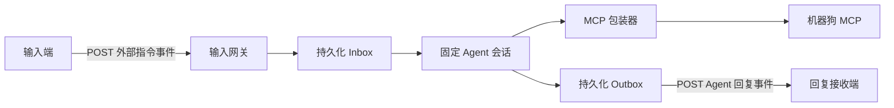

# Agent 输入与最终回复 Webhook 对接指南（MVP）

> 状态：MVP v0.1 已实现，尚待目标环境部署。实现位于 `integrations/agent-webhook-gateway`。
>
> 适用对象：向 Agent 提交用户文本的输入端开发者，以及接收最终回复的回复接收端开发者。

本指南定义输入端系统、Agent 与回复接收端之间的 HTTP Webhook 边界。它独立于 MCP：MCP 只用于 Agent 调用工具，不能替代用户文本输入或最终回复交付。

本边界从输入端已经确认一条完整真实用户请求时开始。麦克风采集、唤醒、语音识别、分段和“是否应提交”的判断都属于输入端；输入网关不会重新判断它们。

开始前，阅读根目录的 [CONTEXT.md](../CONTEXT.md)、[USAGE.md](../USAGE.md) 和 [ADR-0001](adr/0001-agent-webhook-inbox-outbox.md)。本文是该 MVP 对接契约的细化说明。

## 1. 边界与数据流



- 一个部署只有一个固定 Agent 会话。输入端不得传入或切换 `agent_id`、`session_id`、会话路由或 `reply_to`。
- 输入网关先持久化外部指令事件，再返回 `202 Accepted`。这不表示 Agent 已处理、模型已生成回复或机器狗已执行动作。
- 规范化后精确等于“停”或“stop”的语音停止口令是唯一例外：它不会进入 Agent 会话，而是直接触发 `stop_motion`。它不是独立物理急停的替代品。
- 无论 Agent 正常完成还是无法完成，回复端只会收到完整的最终用户可见文本；不会收到 token 流、思考过程、MCP 调用、工具结果、失败事件或部分回复。
- 当普通文本可能导致机器狗运动、但不符合已定义的速度/距离与时长表达时，Agent 会返回追问文本，不会调用运动工具或擅自猜测用户意图。
- 回调失败只会重试回复投递，不会重新运行 Agent，也不会重复机器狗工具调用。
- 网关启动后提供 `POST /v1/instructions`。具体主机与端口由部署方提供；回复接收端需向 Agent 部署方提供部署级回调 URL。

## 2. 输入端需要实现的内容

### 2.1 提交外部指令事件

向部署方提供的 Agent 输入网关 URL 发起请求：

```http
POST <Agent 输入网关 URL>
Content-Type: application/json; charset=utf-8
```

请求体在 v0.1 中只能包含以下字段：

```json
{
  "instruction_id": "6cfbbfbc-7ec5-4c47-a326-b3e2d563a43d",
  "text": "请让机器狗向前走一步"
}
```

| 字段 | 必填 | 规则 |
| --- | --- | --- |
| `instruction_id` | 是 | 由输入端生成的稳定字符串。每个新的用户意图必须唯一；网络重试时必须复用原值。推荐使用 UUID 或 ULID。 |
| `text` | 是 | 原始、非空的 UTF-8 用户文本。输入端已确认它代表完整真实请求；它是给 Agent 的输入，不是 MCP 工具调用、机器狗命令或系统提示词。 |

不要发送额外字段，也不要在 `text` 外传递工具参数、系统提示词、会话标识或每条消息的回调地址。需要扩展时，先更新本契约。

### 2.2 处理输入网关响应

正常受理和同一事件的幂等重投都返回：

```http
HTTP/1.1 202 Accepted
Content-Type: application/json
```

```json
{
  "instruction_id": "6cfbbfbc-7ec5-4c47-a326-b3e2d563a43d",
  "status": "accepted"
}
```

输入端必须将 `202` 理解为“已持久化并等待异步处理”，不能把它当作最终回复或机器狗动作成功。

| 响应 | 含义 | 输入端动作 |
| --- | --- | --- |
| `202 Accepted` | 新事件已持久化，或同一事件已受理。 | 等待回复回调；保留 `instruction_id`。 |
| `400 Bad Request` | JSON、字段或文本不合法。 | 修正请求后以新的用户意图处理。 |
| `409 Conflict` | 同一 `instruction_id` 被用于不同的 `text`。 | 停止重试，排查输入端 ID 生成或持久化逻辑。 |
| `503 Service Unavailable` | 网关暂时不能完成持久化。 | 使用完全相同的请求体和 `instruction_id` 重试。 |

如果请求超时或连接中断，不能假设服务端没有受理。必须用相同的 `instruction_id` 和相同的 `text` 重发，不能为同一用户意图生成新 ID。

### 2.3 输入端最小状态

输入端至少应持久化以下映射，直到收到同一 `instruction_id` 的终态回复：

| 数据 | 用途 |
| --- | --- |
| `instruction_id` | 输入重试和回复关联键。 |
| 原始 `text` | 保证重试请求不发生 ID 与文本冲突。 |
| 受理状态 | 区分尚未收到 `202`、已受理、已收到终态回复。 |
| 已处理的 `reply_id` | 对回复 Webhook 做幂等去重。 |

### 2.4 Agent 侧处理策略

这是 Agent 侧的固定工程策略，不需要输入端选择或配置：输入网关按事件持久化受理顺序串行处理，每个事件达到终态后才向固定 Agent 会话投递下一事件。输入端只需保留 `instruction_id` 并等待相应回复；不得尝试通过外部会话字段、并发重投或到达顺序影响 Agent 调度。

### 2.5 语音停止口令

输入端仍按相同的 JSON schema 提交文本。输入网关按以下规则识别语音停止口令：

1. 对 `text` 做 Unicode NFKC 规范化，移除首尾空白和末尾的 `。`、`.`、`!`、`！`、`?`、`？`。
2. 对 ASCII 字母做小写化。
3. 仅当规范化结果精确等于“停”或 `stop` 时匹配。

因此，“停”、“停。”、“ STOP ”和“stop!”会匹配；“别停”、“停止”和“请停下来”不会匹配，也仍会按普通用户文本交给 Agent。

匹配的事件在持久化和按 `instruction_id` 去重后，直接经 MCP 包装器单次调用 `stop_motion`，不等待 Agent 当前回合，也不进入 Agent FIFO 队列。输入端不得自行直连 `:9990/mcp` 或 `:9991/mcp`，也不得把该能力当作独立物理急停。

语音停止口令也使用普通的最终回复 schema：当 `stop_motion` 已被 MCP 接受时，输出投递器发送 `agent.reply.completed`，并将 `text` 固定为“已发送停止指令。”；该语句只确认停止指令已被接受，不能说明机器狗已完全静止。如果 `stop_motion` 调用失败，则使用既定的通用失败文本“暂时无法完成此请求，请稍后重试。”。

### 2.6 可执行运动文本

输入端继续原样提交用户文本；运动语义由 Agent 处理。当前 MVP 认可三种完整表达：

| 用户表达 | Agent 行为 |
| --- | --- |
| “以 0.1 米每秒走 1 秒”、“后退 0.05 米每秒 2 秒” | 速度加时长：速度为正的幅值，方向可选；未给方向时默认向前。 |
| “走 20 厘米，用 2 秒”、“后退半米，用 2 秒” | 距离加时长：Agent 以距离除以时长计算速度；方向可选，未给方向时默认向前。 |
| “走 1 米”、“后退 30 厘米” | 仅距离：Agent 使用部署标定的默认速度计算时长；方向可选，未给方向时默认向前。 |
| “1 秒”、“以 0.1 米每秒走” | 不完整：时长或速度没有配对参数，Agent 必须追问，不能执行。 |
| “走一点”、“靠近我” | 不完整：没有可执行的速度/时长或距离，Agent 必须追问，不能执行。 |

方向不是必填字段；未出现方向时统一视为向前。当前底层只支持前进与后退，因此左、右、转向等方向词仍需 Agent 追问或拒绝，不能映射为前后运动。

距离请求是估算运动，不是位置控制。“距离加时长”由 Agent 计算速度；“仅距离”由 Agent 根据部署标定的默认速度计算时长。两种换算结果只要求是正的有限数值，不受硬编码速度或时长范围限制；回复仍不能声称机器狗已精确移动或到达该距离。

## 3. 回复接收端需要实现的内容

### 3.1 提供回复回调 URL

回复接收端开发者需为每个环境提供一个由 Agent 输出投递器调用的 HTTP(S) URL。该 URL 是部署级配置，不随每条输入事件变化。

回复接收端必须在完成自身的持久化或幂等确认后再返回任意 `2xx` 响应。网络错误、超时或非 `2xx` 都会触发 Agent 侧的重新投递。

### 3.2 接收成功回复

成功回复由 Agent 输出投递器以 `POST` 发送：

```http
POST <回复接收端回调 URL>
Content-Type: application/json; charset=utf-8
```

```json
{
  "event": "agent.reply.completed",
  "reply_id": "5ca7143f-7fb2-4cdf-a9ff-6d8f5c9b5107",
  "instruction_id": "6cfbbfbc-7ec5-4c47-a326-b3e2d563a43d",
  "text": "好的，我会让机器狗缓慢向前移动。",
  "completed_at": "2026-07-23T12:30:00Z"
}
```

| 字段 | 规则 |
| --- | --- |
| `event` | 固定为 `agent.reply.completed`。 |
| `reply_id` | Agent 侧生成的稳定回复 ID；重投时不变。回复接收端必须用它去重。 |
| `instruction_id` | 对应输入端最初提交的 ID；不得依赖到达顺序关联回复。 |
| `text` | 唯一的完整最终用户可见模型回复。可以直接交给用户，也可能是澄清运动意图的追问；不含内部执行细节、工具调用或推理。 |
| `completed_at` | Agent 完成该轮处理的 UTC ISO 8601 时间。 |

### 3.3 Agent 无法完成时的固定回复

当 Agent 无法产出最终回复时，输出投递器仍按“接收成功回复”的 schema 发送普通事件：

```json
{
  "event": "agent.reply.completed",
  "reply_id": "ebc87aee-0bd2-4b27-baa6-fbaf70060b7a",
  "instruction_id": "6cfbbfbc-7ec5-4c47-a326-b3e2d563a43d",
  "text": "暂时无法完成此请求，请稍后重试。",
  "completed_at": "2026-07-23T12:30:08Z"
}
```

`text` 必须完全等于“暂时无法完成此请求，请稍后重试。”。回复接收端应将它与正常最终文本同样交给用户，例如由 TTS 直接朗读；不得期待或解析 `agent.reply.failed`、错误码、异常详情或部分模型文本。

### 3.4 投递语义

- 回复 Webhook 是至少一次投递。相同 `reply_id` 和相同请求体可能多次到达。
- 回复接收端必须先以 `reply_id` 做幂等确认，再返回 `2xx`。已经处理过的事件仍应返回 `2xx`。
- 多个事件的回调到达顺序不构成业务契约；始终使用 `instruction_id` 和 `reply_id` 关联。
- 回调重试不允许导致 Agent 再次运行，也不允许导致机器狗动作再次执行。

## 4. 配置与网络范围

| 配置项 | 提供方 | 使用方 | 说明 |
| --- | --- | --- | --- |
| Agent 输入网关 URL | Agent 部署方 | 输入端 | 输入端将外部指令事件 POST 到此地址。 |
| 回复接收端回调 URL | 回复接收端开发者 | Agent 部署方 | 输出投递器将 Agent 回复事件 POST 到此地址。 |

参考启动方式：

```powershell
Set-Location "C:/absolute/path/to/pi-hackason/integrations/agent-webhook-gateway"
npm ci --ignore-scripts
npm run build
$env:AGENT_WEBHOOK_REPLY_URL = "http://reply-receiver:9080/agent-replies"
node dist/cli.js
```

默认输入 URL 为 `http://127.0.0.1:8080/v1/instructions`，默认包装器 URL 为 `http://127.0.0.1:9991/mcp`。完整环境变量表见该集成目录的 `README.md`。

当前 MVP 不提供身份校验、签名或重放防护。两个 URL 只能部署在受信任网络中，不能被描述或使用为安全的公网接口。认证方案确定后会作为新的契约版本加入；不要自行在请求体中加入私有鉴权字段。

## 5. 禁止项与安全边界

- 不要把输入 Webhook 当作 MCP endpoint，也不要从输入端直连 `:9990/mcp` 或 `:9991/mcp`。
- 不要把 `202 Accepted` 显示成“机器狗已执行”或“Agent 已回复”。
- 除规范化后精确等于“停”或 `stop` 的语音停止口令外，不要通过自由文本输入实现实时控制或紧急停止。语音停止口令也不替代独立、直接的物理安全路径。
- 不要让 Agent 对不符合“速度加时长”“距离加时长”或“仅距离”的运动文本猜测参数或执行动作；它必须先返回追问文本。
- 不要把“距离”解释为机器狗的定位或到达保证；当前只支持经标定的定时速度估算运动。
- 不要根据 Webhook 到达顺序匹配用户输入与回复。
- 不要把模型的中间 token、推理、工具调用或原始异常转发给用户。

## 6. 联调验收清单

- [ ] 每个新用户意图都生成并持久化唯一 `instruction_id`。
- [ ] 请求丢失响应、超时或收到 `503` 时，使用相同 ID 和相同文本重试。
- [ ] 同一 ID 与不同文本的冲突被输入端监控并人工排查。
- [ ] 输入端只将 `202` 视为异步受理，并等待回复回调。
- [ ] 回复接收端以 `reply_id` 去重；重复投递不会重复展示或执行副作用。
- [ ] Agent 正常完成或失败时都只展示 `text`，不会暴露内部错误。
- [ ] Agent 无法完成时，回复接收端可直接朗读固定文本“暂时无法完成此请求，请稍后重试。”。
- [ ] “走一点”等运动参数不明确的请求会得到追问文本，且不会触发运动工具调用。
- [ ] “以 0.1 米每秒走 1 秒”“走 20 厘米，用 2 秒”和“走 1 米”可作为完整运动请求；“1 秒”和“以 0.1 米每秒走”会得到追问文本。
- [ ] 未给方向的完整运动请求默认向前；左、右、转向等当前不支持的方向词不会被错误映射为前后运动。
- [ ] 距离请求的最终回复不会声称机器狗已精确到达该距离。
- [ ] “停”、“停。”、“ STOP ”和“stop!”会直接触发一次 `stop_motion`，且不等待 Agent FIFO 队列。
- [ ] “别停”、“停止”和“请停下来”不会误触发语音停止口令。
- [ ] `stop_motion` 被接受后，回复接收端可直接朗读“已发送停止指令。”，而不会误报“已停止”。
- [ ] 联调环境使用受信任网络，且不把本 MVP Webhook 暴露到公网。

## 7. 版本与变更

本文定义 v0.1 MVP 契约。新增字段、事件类型、认证方式、查询接口或多 Agent 会话路由前，必须先更新本文、[USAGE.md](../USAGE.md) 和必要的领域边界说明；不得以未文档化的私有字段改变现有行为。
