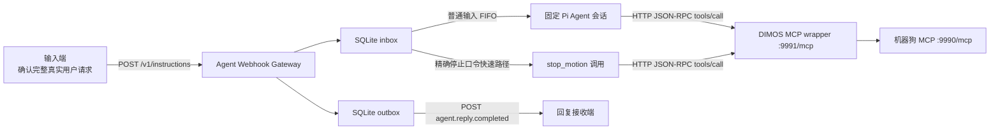

# Agent 输入与最终回复 Webhook 开发对接指南

> 文档版本：MVP v0.1
>
> 实现位置：`integrations/agent-webhook-gateway`
>
> 当前状态：源代码、单元测试和 TypeScript 类型检查已经完成；目标环境部署、真实模型、真实 MCP 包装器、机器狗 MCP 和回复接收端的端到端联调尚未完成。
>
> 适用对象：提交真实用户文本的输入端开发者、接收 Agent 最终回复的回复接收端开发者，以及负责部署和扩展网关的 Agent 侧开发者。

本文描述的是当前项目已经存在的实现，不是未来设计草案。任何接入方都应以本文定义的 HTTP 契约为准，同时注意本文明确列出的模型行为边界和尚未实现能力。

开始开发前，还应阅读：

- 根目录 [CONTEXT.md](../CONTEXT.md)：系统边界、术语和不可违反的不变量。
- 根目录 [USAGE.md](../USAGE.md)：机器狗 MCP、MCP 包装器、hook 和完整部署方式。
- [ADR-0001](adr/0001-agent-webhook-inbox-outbox.md)：选择持久化 inbox/outbox Webhook 架构的原因。
- 网关目录 [README.md](../integrations/agent-webhook-gateway/README.md)：网关本身的安装、配置和开发入口。

## 1. 交付范围

### 1.1 当前已经实现

当前网关已经实现以下能力：

1. 通过 `POST /v1/instructions` 接收带稳定 `instruction_id` 的用户文本。
2. 使用 Node.js 原生 SQLite 将输入先写入 inbox，再返回 `202 Accepted`。
3. 对相同 `instruction_id` 和相同 `text` 的重投做幂等去重。
4. 拒绝相同 `instruction_id` 对应不同 `text` 的冲突请求。
5. 将普通输入按持久化受理顺序串行交给一个固定 Pi Agent 会话。
6. 只向该 Agent 暴露四个机器狗 MCP 工具，并关闭 Pi 内建编码工具。
7. 将规范化后精确等于“停”或 `stop` 的文本作为停止快速路径处理。
8. 将 Agent 最终回复或固定失败文本持久化到 outbox。
9. 通过部署级回复 Webhook 发送完整的最终用户可见文本。
10. 对回复回调失败进行持久化重试，不重新运行 Agent，也不重复 MCP 工具调用。
11. 进程恢复时避免重新执行已经进入 `processing` 状态的输入。

### 1.2 当前没有实现

以下能力不属于 MVP v0.1，接入方不得假设其存在：

- 入站或出站 Webhook 身份认证。
- 请求签名、时间戳校验或重放防护。
- 用户、租户、Agent 或会话路由。
- 每条请求指定不同回调地址。
- 同步等待 Agent 结果的 HTTP 接口。
- 查询输入状态、查询回复、取消输入或人工重放回复的管理接口。
- 健康检查或 readiness HTTP 端点。
- WebSocket、SSE 或 token 流式输出。
- 回复投递最大重试次数、死信队列或自动过期清理。
- 多个网关实例共享同一数据库和会话目录的高可用协调机制。
- 对自然语言运动意图进行确定性的程序级解析或拦截。
- 对模型最终文本进行内容过滤、敏感信息清洗或二次审核。
- 独立物理急停、机器狗遥测、定位或到达确认。

## 2. 保证层级

为了避免把“提示模型这样做”误认为“代码一定会这样做”，当前能力分为三层。

| 层级 | 含义 | 当前示例 |
| --- | --- | --- |
| 程序级保证 | 由 HTTP 校验、SQLite 状态、队列或固定代码路径强制执行。 | 严格请求字段、64 KiB 请求体上限、ID 幂等、普通输入串行、停止快速路径、固定失败回复、outbox 重投。 |
| 模型提示词策略 | 系统提示词要求模型遵守，但当前没有确定性策略引擎在工具调用前再次拦截。 | 运动参数不完整时追问、默认向前、距离换算、拒绝左右转向、不宣称精确到达、最终回复直接面向用户。 |
| 部署和联调责任 | 依赖目标环境、模型配置、网络、MCP 服务和回复接收端共同满足。 | 模型可用、包装器可访问、真实机器狗执行、回调 URL 可达、输入端和回复端持久化。 |

因此：

- 本文写明“网关拒绝”“网关只调用一次”“网关持久化”等内容时，表示程序级行为。
- 本文写明“Agent 应当”“模型被要求”等内容时，表示当前系统提示词策略，不是确定性的自然语言安全策略。
- 如果业务要求“参数不完整时在任何模型行为下都绝不能调用运动工具”，必须新增程序级运动意图解析或工具调用前策略门。目前项目没有这个保证。

## 3. 系统边界与数据流



组件职责如下：

| 组件 | 当前职责 | 不负责 |
| --- | --- | --- |
| 输入端 | 麦克风、唤醒、ASR、分段、确认一次完整真实请求、生成并持久化 `instruction_id`、提交和重试。 | 不直接调用 MCP，不指定 Agent 会话，不解释 `202` 为动作成功。 |
| Agent Webhook Gateway | HTTP 校验、inbox/outbox、幂等、调度、固定 Agent 会话、停止快速路径和回复重投。 | 不采集音频，不判断一次 Webhook 是否是真实请求，不提供认证，不提供物理急停。 |
| 固定 Pi Agent | 接收普通用户文本，根据系统提示词选择最终回复和 MCP 工具调用。 | 不接收外部会话 ID，不启用 Pi 内建编码工具、skills、extensions 或 context files。 |
| MCP 包装器 | 将四个工具单次转发到机器狗 MCP，并执行旁路生命周期 hook。 | 不接收用户自然语言，不重复运动命令，不承担 Webhook 回复投递。 |
| 机器狗 MCP | 验证工具参数、执行 dry-run 或真实机器狗命令、处理运动互斥和零速度停止。 | 不生成用户回复，不接收 `instruction_id`。 |
| 回复接收端 | 持久化并按 `reply_id` 去重，向最终用户显示或通过 TTS 朗读 `text`。 | 不期待模型 token、工具结果、内部错误或独立失败事件。 |

## 4. 输入端 HTTP 契约

### 4.1 Endpoint

当前只接受以下方法和精确路径：

```http
POST /v1/instructions
Content-Type: application/json; charset=utf-8
```

默认完整 URL：

```text
http://127.0.0.1:8080/v1/instructions
```

部署方可以通过环境变量修改监听地址和端口。输入端必须使用部署方提供的实际 URL。

注意：

- 路径必须精确等于 `/v1/instructions`。
- 当前实现不接受路径末尾 `/` 或 query string。
- 其他 HTTP 方法或路径返回 `404`。
- `Content-Type` 必须以 `application/json` 开头；接入方应始终发送标准的 `application/json; charset=utf-8`。
- 整个 HTTP 请求体最多为 65,536 字节，即 64 KiB。该上限包含 JSON 字段名、引号和其他 JSON 开销，不是单独的 `text` 字段上限。
- 超过 64 KiB 的请求返回 `400 Bad Request`。

### 4.2 请求体

请求体必须是 JSON object，并且只能包含 `instruction_id` 和 `text` 两个字段：

```json
{
  "instruction_id": "6cfbbfbc-7ec5-4c47-a326-b3e2d563a43d",
  "text": "请让机器狗向前走 1 米"
}
```

| 字段 | 类型 | 必填 | 当前校验 |
| --- | --- | --- | --- |
| `instruction_id` | string | 是 | 去除首尾空白后必须非空。当前不强制 UUID/ULID 格式，也没有独立长度限制，但整个请求受 64 KiB 上限约束。 |
| `text` | string | 是 | 去除首尾空白后必须非空。服务保存并向 Agent 传递原始字符串，不会自动 trim、改写、翻译或结构化。 |

禁止发送第三个字段，包括但不限于：

- `agent_id`
- `session_id`
- `user_id`
- `reply_to`
- `callback_url`
- `tool`
- `arguments`
- `system_prompt`
- `metadata`

存在任何额外字段时，整个请求返回 `400`。

### 4.3 `instruction_id` 生成和持久化

输入端必须为每个新的完整用户意图生成稳定且唯一的字符串 ID。推荐 UUID v4 或 ULID，但当前服务端只要求非空字符串。

输入端必须遵守以下规则：

1. 在首次发送 HTTP 请求前，先持久化 `instruction_id` 和原始 `text`。
2. 同一用户意图因超时、断网或 `503` 重试时，必须复用完全相同的 ID 和完全相同的文本。
3. 不要因为没有收到 HTTP 响应就生成新 ID；服务端可能已经持久化成功。
4. 新的用户意图必须生成新 ID。
5. 同一 ID 的文本比较是精确字符串比较。大小写、空白或标点变化都会被视为不同文本并返回 `409`。

例如，以下两个请求会冲突：

```json
{"instruction_id":"request-1","text":"向前走"}
```

```json
{"instruction_id":"request-1","text":"向前走。"}
```

### 4.4 正常受理响应

新事件完成 SQLite 持久化后返回：

```http
HTTP/1.1 202 Accepted
Content-Type: application/json; charset=utf-8
```

```json
{
  "instruction_id": "6cfbbfbc-7ec5-4c47-a326-b3e2d563a43d",
  "status": "accepted"
}
```

相同 `instruction_id` 和完全相同 `text` 的幂等重投也返回相同结构的 `202`。

`202` 只表示：

- 请求结构有效；
- 输入已经存在于 inbox 中；
- 网关将异步处理该输入，或该输入此前已经受理。

`202` 不表示：

- Agent 已经开始或完成处理；
- 模型已经生成回复；
- MCP 工具已被调用；
- MCP 包装器或机器狗 MCP 接受了命令；
- 机器狗已经移动或停止；
- 回复回调已经成功。

### 4.5 错误响应

当前错误响应如下：

| HTTP 状态 | 响应体 | 触发条件 | 输入端动作 |
| --- | --- | --- | --- |
| `400 Bad Request` | `{"error":"invalid_request"}` | Content-Type 不合法、JSON 无法解析、请求体超过 64 KiB、字段不是严格两个、字段类型错误或字符串为空。 | 修正请求。若它代表新的用户意图，使用新 ID；不要无修改无限重试。 |
| `404 Not Found` | `{"error":"not_found"}` | 方法或路径不等于 `POST /v1/instructions`。 | 修正 URL 或 HTTP 方法。 |
| `409 Conflict` | `{"error":"instruction_id_conflict"}` | 同一 ID 已经绑定不同的原始文本。 | 停止自动重试，排查 ID 生成、持久化或文本变更。 |
| `503 Service Unavailable` | `{"error":"persistence_unavailable"}` | 受理过程中出现未被归类的内部错误，包括持久化失败。 | 使用完全相同的 ID 和文本按输入端策略重试。 |

当前没有结构化错误详情、错误追踪 ID 或 `Retry-After` header。

### 4.6 推荐的输入端重试状态机

输入端至少持久化：

| 数据 | 用途 |
| --- | --- |
| `instruction_id` | 重试与最终回复关联键。 |
| 原始 `text` | 保证重试时文本逐字节保持一致。 |
| 当前提交状态 | 区分未发送、等待响应、已受理、冲突和已收到终态回复。 |
| 已处理的 `reply_id` | 对回复 Webhook 去重。 |

推荐处理原则：

1. `202`：标记为已受理，停止入站重试，等待回复回调。
2. 网络错误或请求超时：状态保持不确定，使用相同 ID 和文本重试。
3. `503`：使用相同 ID 和文本重试。
4. `400`：视为客户端契约错误，停止自动重试。
5. `404`：视为部署配置错误，停止自动重试。
6. `409`：视为 ID 冲突，停止自动重试并告警。

网关没有提供状态查询接口。如果输入端收到 `202` 后长期没有回调，只能由部署方检查网关、SQLite outbox、回调网络和日志，不能通过当前 API 查询状态。

## 5. 网关处理语义

### 5.1 持久化 Inbox

网关使用 Node.js 原生 SQLite，默认数据库文件为：

```text
<网关进程当前目录>/data/agent-webhook.sqlite
```

数据库启用：

- `PRAGMA journal_mode = WAL`
- `PRAGMA foreign_keys = ON`

输入表保存：

- 自增受理顺序 `sequence`
- 唯一 `instruction_id`
- 原始 `text`
- 是否为停止快速路径
- `pending`、`processing` 或 `completed` 状态
- UTC 接收时间

HTTP `202` 只会在 `acceptInstruction` 完成后发送。

### 5.2 普通输入队列

普通输入按照 SQLite `sequence` 顺序处理：

1. 从最早的 `pending` 普通输入中领取一条。
2. 将其状态改为 `processing`。
3. 将原始 `text` 交给固定 Pi Agent 会话。
4. 等待该轮 Agent 完成。
5. 将最终回复写入 outbox，并将输入标记为 `completed`。
6. 再领取下一条普通输入。

因此，一个网关进程内同时只处理一个普通 Agent 回合。

这不表示回复 Webhook 必然按输入顺序成功到达。回调失败、重试和接收端网络状态可能改变实际到达顺序，回复端必须使用 ID 关联。

### 5.3 固定 Pi Agent 会话

当前部署只创建一个 Pi Agent 会话：

- 使用 `AGENT_WEBHOOK_AGENT_CWD` 作为 Agent 工作目录。
- 使用 `AGENT_WEBHOOK_AGENT_DIR` 读取 Pi 的模型、认证和设置。
- 使用 `AGENT_WEBHOOK_SESSION_DIR` 持久化会话。
- 启动时通过 `SessionManager.continueRecent` 继续该目录下最近的会话。
- 外部请求不能指定、切换或重置会话。

当前 Agent 资源加载器明确关闭：

- Pi extensions
- skills
- prompt templates
- themes
- context files
- Pi 内建编码工具

当前只注册并保持激活以下四个自定义工具：

| 工具 | 参数 | Gateway 到包装器的行为 |
| --- | --- | --- |
| `move_forward` | `speed_mps: number`、`duration_s: number` | 单次调用包装器同名工具。两个值在工具 schema 中必须大于 0。 |
| `move_backward` | `speed_mps: number`、`duration_s: number` | 单次调用包装器同名工具。两个值在工具 schema 中必须大于 0。 |
| `stop_motion` | 无 | 单次调用包装器同名工具。 |
| `motion_status` | 无 | 单次调用包装器同名工具。 |

网关不会自动重试任何 MCP 工具调用。

### 5.4 最终回复提取

每个普通输入完成后，网关只读取本轮新增的最后一条 assistant 文本：

- 不发送 token 流。
- 不发送模型中间状态。
- 不发送工具调用结构。
- 不发送原始 MCP 返回对象。
- 不发送推理过程。

如果 Agent 抛出异常、没有产生新的 assistant 消息、最后文本为空或只包含空白，网关使用固定失败文本：

```text
暂时无法完成此请求，请稍后重试。
```

系统提示词明确告诉模型：

> 你的最终输出会直接发给用户。

并要求最终文本完整、简洁、直接面向用户，不包含内部推理、工具过程、原始结果或堆栈。

但是，当前没有程序级文本清洗器检查模型最终文本。传输层保证只发送“最终 assistant 文本”，但最终文本本身是否完全遵循内容要求仍依赖模型。

## 6. 停止口令快速路径

### 6.1 匹配规则

网关对所有输入先执行以下规范化：

1. Unicode NFKC 规范化。
2. 移除首尾空白。
3. 移除末尾连续出现的 `。`、`.`、`！`、`!`、`？`、`?`。
4. 再次移除首尾空白。
5. 使用 JavaScript `toLowerCase()` 转为小写。
6. 仅当结果精确等于“停”或 `stop` 时进入快速路径。

匹配示例：

| 原始文本 | 是否匹配 |
| --- | --- |
| `停` | 是 |
| `停。` | 是 |
| ` STOP ` | 是 |
| `stop!` | 是 |
| `别停` | 否 |
| `停止` | 否 |
| `请停下来` | 否 |
| `stop now` | 否 |

### 6.2 执行行为

停止事件仍然：

- 使用普通请求 schema；
- 先写入 SQLite inbox；
- 使用 `instruction_id` 幂等；
- 最终写入普通 outbox；
- 使用相同回复 Webhook schema。

与普通输入不同的是：

- 它不会进入 Pi Agent 会话。
- 它使用独立的停止队列。
- 它不等待正在进行的普通 Agent 回合。
- 它向 MCP 包装器单次调用 `stop_motion`。
- 多个停止事件之间仍按各自的持久化顺序串行处理。

当 MCP 调用未抛出错误、HTTP 响应成功且 MCP `result.isError` 不为 `true` 时，回复固定为：

```text
已发送停止指令。
```

这句话只表示包装器接受了该 MCP 调用结果，不表示已经从机器狗遥测确认物理静止。

当请求超时、HTTP 失败、JSON-RPC error、MCP `result.isError: true` 或响应结构不合法时，回复固定为：

```text
暂时无法完成此请求，请稍后重试。
```

停止快速路径不是独立物理急停。真实部署仍必须具备不经过模型、Webhook、网关和普通网络链路的物理安全路径。

## 7. 自然语言运动语义

### 7.1 当前系统提示词要求

普通文本由 Pi Agent 模型解释。当前系统提示词要求模型按以下规则处理：

| 用户表达 | 期望的模型行为 |
| --- | --- |
| “以 0.1 米每秒走 1 秒” | 默认向前，调用 `move_forward(speed_mps=0.1, duration_s=1)`。 |
| “后退 0.05 米每秒 2 秒” | 调用 `move_backward(speed_mps=0.05, duration_s=2)`。 |
| “走 20 厘米，用 2 秒” | 将 0.2 米除以 2 秒，默认向前。 |
| “后退半米，用 2 秒” | 将 0.5 米除以 2 秒，方向向后。 |
| “走 1 米” | 使用 `AGENT_WEBHOOK_DEFAULT_SPEED_MPS` 计算时长，默认向前。 |
| “后退 30 厘米” | 使用部署标定速度计算时长，方向向后。 |
| “1 秒” | 参数不完整，向用户追问。 |
| “以 0.1 米每秒走” | 参数不完整，向用户追问。 |
| “走一点” | 没有可计算参数，向用户追问。 |
| “向左走”或“转向” | 当前工具不支持，说明不支持，不得映射为前进或后退。 |

提示词中的计算规则：

- 方向可选，未提供方向时默认向前。
- 速度加时长可以直接形成工具参数。
- 距离加时长使用“距离 ÷ 时长”计算速度。
- 仅距离使用部署标定速度计算时长。
- 速度和时长必须是正的有限数值。
- 当前不添加硬编码速度或时长上限，也不得擅自修改用户明确指定的数值。
- 距离运动只是定时速度估算，不是定位控制。
- 最终回复不得声称已经精确移动或到达指定距离。

### 7.2 当前保证边界

上述自然语言语义目前只存在于：

- Agent 系统提示词；
- 四个工具的名称、描述和 TypeBox 参数 schema。

当前不存在：

- 确定性的中文运动指令解析器；
- 在模型调用工具前验证原始用户文本与工具参数一致性的策略门；
- 验证模型计算结果是否符合距离公式的独立代码；
- 阻止模型在不完整指令下调用运动工具的 before-tool 拦截器；
- 真实模型行为的自动化验收测试。

工具 schema 能够拒绝非数字、非正数或额外参数，但不能判断这些数字是否忠实来自用户文本。

因此，对接方必须把本节理解为“当前 Agent 的模型策略”，而不是 Webhook 协议的确定性安全保证。如果项目验收要求无论模型如何响应都绝不误执行，必须先补充程序级策略门，再把相应行为升级为程序级保证。

## 8. Gateway 到 MCP 包装器的协议

网关默认调用：

```text
http://127.0.0.1:9991/mcp
```

每个工具调用发送一次 HTTP POST：

```http
POST /mcp
Accept: application/json
Content-Type: application/json
```

示例：

```json
{
  "jsonrpc": "2.0",
  "id": 1,
  "method": "tools/call",
  "params": {
    "name": "move_forward",
    "arguments": {
      "speed_mps": 0.1,
      "duration_s": 2
    }
  }
}
```

当前网关 MCP 客户端的现实行为：

- 请求 ID 从进程内的 `1` 开始递增。
- 每次工具调用只发送一个 `tools/call` 请求。
- 不执行 MCP `initialize` 或 `tools/list`。
- 不自动重试网络、HTTP、JSON-RPC 或工具错误。
- 使用 `AGENT_WEBHOOK_MCP_TIMEOUT_MS` 设置单次超时。
- HTTP 非成功状态视为失败。
- JSON-RPC `error` 视为失败。
- `result.isError === true` 视为失败。
- DIMOS 包装的 `Error running tool '...'` 文本视为失败。
- JSON 文本结果中的 `{"status":"error","error":"..."}` 视为失败。
- 成功时提取 `result.content` 中所有 `type: "text"` 项并以换行连接。
- 没有文本项时，将完整 `result` JSON 序列化为工具结果文本。

因此，网关下游必须是当前项目的 DIMOS MCP 包装器或另一个兼容上述直接 `tools/call` HTTP 请求的服务。

包装器上的 `before_call`、`after_success`、`after_error` 和 `finally` hook 由包装器负责。网关不直接配置、等待或读取这些 hook。hook 失败也不会改变网关的工具调用结果。

## 9. 回复 Webhook 契约

### 9.1 回调 URL

回复接收端必须向 Agent 部署方提供一个部署级绝对 HTTP(S) URL，例如：

```text
http://reply-receiver:9080/agent-replies
```

该 URL 通过 `AGENT_WEBHOOK_REPLY_URL` 配置：

- 是启动必填项；
- 对整个网关部署生效；
- 不能由单条输入指定；
- 必须是绝对 `http://` 或 `https://` URL。

### 9.2 回调请求

所有成功、追问、拒绝和固定失败结果都使用同一个事件类型：

```http
POST <AGENT_WEBHOOK_REPLY_URL>
Content-Type: application/json; charset=utf-8
```

```json
{
  "event": "agent.reply.completed",
  "reply_id": "5ca7143f-7fb2-4cdf-a9ff-6d8f5c9b5107",
  "instruction_id": "6cfbbfbc-7ec5-4c47-a326-b3e2d563a43d",
  "text": "好的，我已经提交了向前运动指令。",
  "completed_at": "2026-07-23T12:30:00.000Z"
}
```

| 字段 | 类型 | 当前规则 |
| --- | --- | --- |
| `event` | string | 固定为 `agent.reply.completed`。 |
| `reply_id` | string | 网关生成的 UUID。与一个 `instruction_id` 一对一；重投时保持不变。 |
| `instruction_id` | string | 输入端最初提交的原始 ID。 |
| `text` | string | 唯一应显示或朗读给用户的完整终态文本。 |
| `completed_at` | string | 网关形成 outbox 事件时的 UTC ISO 8601 时间，由 `Date.toISOString()` 产生。 |

不存在以下事件：

- `agent.reply.failed`
- `agent.reply.started`
- `agent.reply.delta`
- `agent.tool.called`
- `agent.motion.completed`

回复接收端不得依赖或等待这些事件。

### 9.3 回复接收端确认

回复接收端返回任意 `2xx` HTTP 状态，网关即认为投递成功。响应体内容不参与判断。

回复接收端必须：

1. 解析并验证 JSON。
2. 以 `reply_id` 做幂等去重。
3. 在完成本地持久化或确认该 ID 已经处理后，再返回 `2xx`。
4. 对重复 `reply_id` 返回 `2xx`，但不得重复展示、重复 TTS 或执行其他副作用。
5. 使用 `instruction_id` 与输入端记录关联，不依赖到达顺序。
6. 将 `text` 作为最终面向用户的完整回复处理。

网络错误、超时或任何非 `2xx` 响应都被视为投递失败。

### 9.4 固定失败文本

当普通 Agent 回合失败、没有最终文本，或者停止快速路径调用失败时，网关仍发送普通 `agent.reply.completed`，并将 `text` 固定为：

```text
暂时无法完成此请求，请稍后重试。
```

回复接收端应直接向用户显示或朗读这句话，不要期待额外错误码、异常详情或失败事件。

### 9.5 至少一次投递与重试

回复 Webhook 是至少一次投递：

- outbox 在首次 HTTP 回调前已经持久化。
- 同一事件重投时 `reply_id`、`instruction_id`、`text` 和 `completed_at` 保持不变。
- 单次回调超时由 `AGENT_WEBHOOK_REPLY_TIMEOUT_MS` 控制。
- 首次失败后等待 `AGENT_WEBHOOK_RETRY_BASE_MS`。
- 后续等待时间按指数增长，并限制在 `AGENT_WEBHOOK_RETRY_MAX_MS`。
- 当前没有最大尝试次数，未确认事件会持续重试。
- 重试时间和尝试次数保存在 SQLite 中，进程重启后继续。
- 回调重试不会重新运行 Agent。
- 回调重试不会重新调用 MCP。

不同事件的实际到达顺序不是契约。回复端必须只按 ID 关联。

### 9.6 重复输入与回复重放的区别

当输入端重复提交已经存在的相同 ID 和相同文本时：

- 网关返回 `202`；
- 不重新运行 Agent；
- 不创建新的 `reply_id`；
- 如果原 outbox 尚未确认，它会按原重试计划继续投递；
- 如果原 outbox 已经确认，当前实现不会因为重复输入而重新发送已经成功投递的回复。

当前没有人工重放已成功回复的 API。

## 10. 崩溃和重启语义

网关启动时处理现有 SQLite 状态：

| 持久化状态 | 启动后的行为 |
| --- | --- |
| `pending` 普通输入 | 按原 `sequence` 继续交给固定 Agent。 |
| `pending` 停止输入 | 由停止队列继续调用一次 `stop_motion`。 |
| `processing` 输入 | 不重新运行 Agent 或 MCP；直接创建固定失败回复并进入 outbox。 |
| `completed` 且回复未确认 | 按持久化的下一次尝试时间继续回调。 |
| `completed` 且回复已确认 | 不再投递。 |

`processing` 状态采用固定失败而不是自动重跑，是为了避免进程在机器狗副作用已经发生、但 outbox 尚未写入时重复执行动作。

部署方必须持久保存：

- `AGENT_WEBHOOK_DATABASE_PATH`
- `AGENT_WEBHOOK_SESSION_DIR`
- Pi 模型与认证所在的 `AGENT_WEBHOOK_AGENT_DIR`

不要在服务重启时删除这些目录。

当前没有多实例 leader election 或数据库级 Agent 会话租约。一个数据库文件和一个 session 目录只能由一个活动网关进程使用。

## 11. 配置

### 11.1 环境变量

| 环境变量 | 必填 | 默认值 | 校验与含义 |
| --- | --- | --- | --- |
| `AGENT_WEBHOOK_REPLY_URL` | 是 | 无 | 回复接收端绝对 HTTP(S) URL。缺失或协议不是 HTTP(S) 时启动失败。 |
| `AGENT_WEBHOOK_HOST` | 否 | `127.0.0.1` | HTTP 监听主机字符串。 |
| `AGENT_WEBHOOK_PORT` | 否 | `8080` | 1 至 65535 的正整数。 |
| `AGENT_WEBHOOK_DATABASE_PATH` | 否 | `<cwd>/data/agent-webhook.sqlite` | SQLite inbox/outbox 路径。相对路径按网关进程 cwd 解析。 |
| `AGENT_WEBHOOK_MCP_URL` | 否 | `http://127.0.0.1:9991/mcp` | MCP 包装器绝对 HTTP(S) URL。 |
| `AGENT_WEBHOOK_MCP_TIMEOUT_MS` | 否 | `10000` | 单次 MCP HTTP 请求超时，必须是正有限数。 |
| `AGENT_WEBHOOK_REPLY_TIMEOUT_MS` | 否 | `10000` | 单次回复回调超时，必须是正有限数。 |
| `AGENT_WEBHOOK_RETRY_BASE_MS` | 否 | `1000` | 首次回调重试等待时间，必须是正有限数。 |
| `AGENT_WEBHOOK_RETRY_MAX_MS` | 否 | `60000` | 指数重试等待上限，必须是正有限数。当前不要求它大于 base。 |
| `AGENT_WEBHOOK_AGENT_CWD` | 否 | 网关进程 cwd | 固定 Agent 的工作目录。相对路径按网关进程 cwd 解析。 |
| `AGENT_WEBHOOK_AGENT_DIR` | 否 | `~/.pi/agent` | Pi 模型、认证和设置目录。 |
| `AGENT_WEBHOOK_SESSION_DIR` | 否 | `<cwd>/data/agent-session` | 固定 Agent 会话持久化目录。 |
| `AGENT_WEBHOOK_DEFAULT_SPEED_MPS` | 否 | `0.1` | 仅距离请求在系统提示词中使用的部署标定速度，必须是正有限数。 |

所有环境变量只在进程启动时读取。修改后需要重启网关。

### 11.2 推荐部署配置

生产式联调至少显式配置：

```powershell
$env:AGENT_WEBHOOK_HOST = "0.0.0.0"
$env:AGENT_WEBHOOK_PORT = "8080"
$env:AGENT_WEBHOOK_DATABASE_PATH = "C:/persistent-data/agent-webhook.sqlite"
$env:AGENT_WEBHOOK_SESSION_DIR = "C:/persistent-data/agent-session"
$env:AGENT_WEBHOOK_AGENT_DIR = "C:/Users/service-user/.pi/agent"
$env:AGENT_WEBHOOK_AGENT_CWD = "C:/agent-workspace"
$env:AGENT_WEBHOOK_MCP_URL = "http://127.0.0.1:9991/mcp"
$env:AGENT_WEBHOOK_REPLY_URL = "http://reply-receiver:9080/agent-replies"
$env:AGENT_WEBHOOK_DEFAULT_SPEED_MPS = "0.1"
```

如果监听 `0.0.0.0`，必须由受信任网络、主机防火墙或反向代理限制来源。当前应用本身没有鉴权。

## 12. 安装和启动

### 12.1 前置条件

- Node.js 22.19.0 或更高版本。
- Pi 已经完成模型和认证配置。
- DIMOS 机器狗 MCP 已启动。
- DIMOS MCP 包装器已启动并能接受直接 HTTP `tools/call`。
- 回复接收端 URL 已实现并可访问。
- 数据库和 session 目录位于持久化磁盘。

### 12.2 构建

```powershell
Set-Location "C:/absolute/path/to/pi-hackason/integrations/agent-webhook-gateway"
npm ci --ignore-scripts
npm run build
```

构建输出目录为：

```text
integrations/agent-webhook-gateway/dist
```

当前仓库不提交 `dist`，部署时必须执行构建。

### 12.3 启动顺序

推荐顺序：

1. 启动机器狗 MCP，首次联调保持 dry-run。
2. 启动 DIMOS MCP 包装器。
3. 启动并验证回复接收端。
4. 设置网关环境变量。
5. 启动 Agent Webhook Gateway。
6. 输入端开始发送测试指令。

启动命令：

```powershell
$env:AGENT_WEBHOOK_REPLY_URL = "http://reply-receiver:9080/agent-replies"
$env:AGENT_WEBHOOK_MCP_URL = "http://127.0.0.1:9991/mcp"
node dist/cli.js
```

成功监听时输出：

```text
agent webhook gateway listening on http://<host>:<port>/v1/instructions
```

当前没有独立健康检查端点。联调时应结合：

- 进程状态；
- 上述监听日志；
- 实际 `POST /v1/instructions` 请求；
- 回复接收端收到的事件；
- MCP 包装器和机器狗 MCP 日志；
- SQLite 文件是否持续存在。

### 12.4 关闭

CLI 处理 `SIGINT` 和 `SIGTERM`：

1. 停止接受新连接。
2. 等待当前 Agent、停止和回复投递任务完成。
3. 关闭 Agent 会话。
4. 关闭 SQLite。

当前普通 Agent 模型回合没有网关级独立超时。若模型调用本身长期不返回，优雅关闭也可能等待该回合结束。

## 13. 输入端开发示例

### 13.1 curl

```bash
curl --request POST "http://127.0.0.1:8080/v1/instructions" \
  --header "Content-Type: application/json; charset=utf-8" \
  --data '{"instruction_id":"6cfbbfbc-7ec5-4c47-a326-b3e2d563a43d","text":"向前走 1 米"}'
```

### 13.2 PowerShell

```powershell
$body = @{
    instruction_id = "6cfbbfbc-7ec5-4c47-a326-b3e2d563a43d"
    text = "向前走 1 米"
} | ConvertTo-Json -Compress

Invoke-RestMethod `
    -Method Post `
    -Uri "http://127.0.0.1:8080/v1/instructions" `
    -ContentType "application/json; charset=utf-8" `
    -Body $body
```

### 13.3 TypeScript

```typescript
type AcceptedInstruction = {
  instruction_id: string;
  status: "accepted";
};

async function submitInstruction(
  gatewayUrl: string,
  instructionId: string,
  text: string,
): Promise<AcceptedInstruction> {
  const response = await fetch(`${gatewayUrl}/v1/instructions`, {
    method: "POST",
    headers: {
      "content-type": "application/json; charset=utf-8",
    },
    body: JSON.stringify({
      instruction_id: instructionId,
      text,
    }),
  });

  if (response.status === 202) {
    return await response.json() as AcceptedInstruction;
  }

  const errorBody = await response.text();
  throw new Error(`Gateway returned ${response.status}: ${errorBody}`);
}
```

实际实现必须在调用该函数前持久化 ID 和文本，并按第 4.6 节区分可重试与不可重试错误。

## 14. 回复接收端开发示例

以下示例只说明协议处理顺序，不规定接收端框架：

```typescript
type AgentReplyEvent = {
  event: "agent.reply.completed";
  reply_id: string;
  instruction_id: string;
  text: string;
  completed_at: string;
};

async function receiveReply(request: Request): Promise<Response> {
  const event = await request.json() as AgentReplyEvent;

  if (event.event !== "agent.reply.completed") {
    return new Response("invalid event", { status: 400 });
  }

  // 必须由接收端实现为持久化幂等操作。
  const inserted = await persistReplyIfAbsent(event.reply_id, event);

  if (inserted) {
    await enqueueUserDelivery(event.instruction_id, event.text);
  }

  return new Response(null, { status: 204 });
}
```

接收端应将持久化与用户交付解耦。建议先可靠保存事件，再返回 `2xx`，随后由自己的队列完成 UI 展示或 TTS；否则接收端在返回 `2xx` 后崩溃可能永久丢失用户交付。

## 15. Agent 侧扩展开发

网关当前暴露三个主要抽象：

| 抽象 | 当前实现 | 扩展用途 |
| --- | --- | --- |
| `UserTextAgent` | `PiUserTextAgent` | 替换用户文本运行时。 |
| `McpToolCaller` | `HttpMcpToolClient` | 替换 MCP 传输或测试 seam。 |
| `ReplyEventDelivery` | `ReplyWebhookClient` | 替换最终回复投递适配器。 |

扩展时不得改变以下核心契约，除非先更新 `CONTEXT.md`、ADR、`USAGE.md` 和本文：

- 输入必须先持久化再返回 `202`。
- `instruction_id` 幂等和冲突语义。
- 普通输入固定会话串行处理。
- 停止口令的精确匹配和独立快速路径。
- 每个输入最多形成一个稳定 `reply_id`。
- outbox 必须先持久化再回调。
- 回调重试不得重跑 Agent 或 MCP。
- Agent 失败仍使用普通 `agent.reply.completed` 和固定失败文本。
- 只交付最终用户可见文本。

如果增加新的用户可见功能，必须同步更新根 `USAGE.md`。如果改变术语、架构边界或不变量，还必须同步更新根 `CONTEXT.md`。

## 16. 当前自动化验证范围

当前项目已经通过：

```powershell
Set-Location "E:/Documents/GitHub/pi-hackason/integrations/agent-webhook-gateway"
npm test
npx tsc -p tsconfig.json --noEmit
```

当前结果：

- 4 个测试文件通过。
- 18 个测试通过。
- TypeScript 类型检查通过。

自动化测试已覆盖：

- 停止口令精确规范化匹配。
- 输入持久化后返回 `202`。
- 完整最终回复 callback schema。
- 相同 ID 幂等和不同文本冲突。
- 普通输入固定会话串行顺序。
- 停止事件绕过被阻塞的普通 Agent 回合。
- 停止成功和失败的固定回复。
- 回调失败使用相同 `reply_id` 重试且不重跑 Agent。
- Agent 失败时的固定用户回复。
- outbox 重试在进程恢复后继续且不重跑 Agent。
- 包装器 MCP 每个工具调用只发送一次 `tools/call`。
- MCP `result.isError` 被识别为失败。
- DIMOS 异常文本和结构化工具错误被识别为失败。
- 系统提示词包含“最终输出会直接发给用户”和运动语义。
- 固定 Agent 只激活四个机器狗自定义工具。
- 必填回复 URL 和主要默认配置。

当前自动化测试没有覆盖：

- 真实模型是否稳定遵循自然语言运动规则。
- 真实模型认证和 provider 网络。
- `npm run build` 生成物的目标机运行。
- 真实 DIMOS MCP 包装器和机器狗 MCP 的端到端调用。
- 真实 Go2 硬件动作。
- 真实回复接收端和输入端的跨主机网络。
- 进程强制终止、磁盘损坏或 SQLite 文件恢复。
- 64 KiB 边界值的自动化回归测试。
- 长时间运行、数据库增长、回调永久失败和资源占用。
- 多实例部署。

## 17. 最终联调验收清单

### 17.1 输入端

- [ ] 每个新用户意图在发送前生成并持久化唯一 `instruction_id`。
- [ ] 同一意图的网络重试复用完全相同的 ID 和原始文本。
- [ ] 请求体只包含 `instruction_id` 和 `text`。
- [ ] 请求体始终小于或等于 64 KiB。
- [ ] `202` 只被解释为异步受理。
- [ ] 网络错误、超时和 `503` 使用相同请求重试。
- [ ] `400`、`404` 和 `409` 停止自动重试并进入错误处理。
- [ ] 输入端不直连 `:9990/mcp` 或 `:9991/mcp`。

### 17.2 回复接收端

- [ ] 提供部署级 HTTP(S) 回调 URL。
- [ ] 在持久化事件后才返回 `2xx`。
- [ ] 使用 `reply_id` 去重。
- [ ] 重复事件不会重复显示、TTS 或触发副作用。
- [ ] 使用 `instruction_id` 关联原输入，不依赖回调顺序。
- [ ] 只消费 `agent.reply.completed` 的 `text`。
- [ ] 固定失败文本可以直接向用户显示或朗读。
- [ ] 非 `2xx`、连接断开和超时场景能触发网关重投。

### 17.3 Agent 与 MCP

- [ ] Pi 模型和认证在 `AGENT_WEBHOOK_AGENT_DIR` 中有效。
- [ ] 包装器 MCP 可从网关主机访问。
- [ ] 机器狗 MCP 初次联调运行在 dry-run。
- [ ] 四个工具在真实包装器链路上可调用。
- [ ] 每个工具调用只到达下游一次。
- [ ] “停”、“停。”、“ STOP ”和“stop!”绕过 Agent。
- [ ] “别停”、“停止”、“请停下来”和“stop now”不会误入快速路径。
- [ ] 停止成功回复为“已发送停止指令。”，而不是“机器狗已停止”。
- [ ] 停止失败回复为固定通用失败文本。

### 17.4 模型行为

以下项目必须在目标模型上实际验收；现有单元测试不能替代：

- [ ] “以 0.1 米每秒走 1 秒”形成正确的向前工具参数。
- [ ] “走 20 厘米，用 2 秒”正确计算速度。
- [ ] “走 1 米”使用部署标定速度计算时长。
- [ ] 未给方向的完整运动请求默认向前。
- [ ] “1 秒”“以 0.1 米每秒走”和“走一点”只追问，不调用运动工具。
- [ ] 左、右、转向不会被错误映射为前进或后退。
- [ ] 最终回复不声称已经精确到达指定距离。
- [ ] 最终回复直接面向用户，不包含内部推理、工具结构或异常堆栈。

如果上述“不调用运动工具”必须成为硬性安全保证，应在交付前增加程序级策略门；仅通过本清单的模型抽样测试仍不等于确定性保证。

### 17.5 持久化与恢复

- [ ] 数据库和 session 目录位于持久化磁盘。
- [ ] 重启后 `pending` 输入继续处理。
- [ ] 重启后未确认 outbox 继续使用同一 `reply_id` 投递。
- [ ] `processing` 输入在恢复后生成固定失败回复，不重复执行动作。
- [ ] 不同时运行两个共享同一数据库/session 的网关进程。
- [ ] 已评估数据库备份、磁盘容量、日志采集和人工故障处理。

### 17.6 网络和安全

- [ ] 入站和出站 URL 只位于受信任网络。
- [ ] 未将当前无鉴权接口直接暴露到公网。
- [ ] 主机防火墙或反向代理限制可访问来源。
- [ ] 真实机器狗具备独立物理急停。
- [ ] 没有把语音停止口令当作物理急停替代品。

## 18. 当前交付结论

从源代码和自动化测试角度，Webhook inbox/outbox、固定 Agent 会话、停止快速路径、MCP 单次调用和最终回复投递的 MVP 已经实现。

在目标环境完成第 17 节联调前，项目只能声明：

> 接口实现和代码级行为已经完成，目标部署和真实链路尚未验收。

不得提前声明：

- 真实模型一定会遵循所有运动语义；
- 真实 MCP 或机器狗动作已经验证；
- 目标回复接收端已经可靠接收；
- 该接口可以安全暴露到公网；
- 停止回复证明机器狗物理静止；
- 距离请求证明机器狗精确到达目标位置。

完成联调后，交付方应保存实际环境变量、输入与回复样例、MCP 日志、回调去重证据和机器狗 dry-run/实机验收记录，作为最终交付证据。
