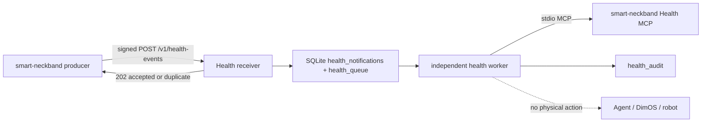

# 智能项圈 Health MCP v0.2 消费端对接指南

> 契约版本：`0.2.0`
>
> 实现位置：`components/agent-framework/agent-webhook-gateway`
>
> 实现边界：本仓库只实现 Health Webhook 接收方和 Health MCP 消费方；项圈采集、状态构建、事件生成、outbox 发送和 Health MCP Server 属于上游 `smart-neckband` 仓库。

需要与上游开发逐项确认实现和联调结果时，使用 [Health MCP v0.2 双方实现核对与联调验收清单](health-mcp-v0.2-cross-team-verification-checklist.md)。

## 1. 交付范围

当前实现提供：

1. 独立的 `POST /v1/health-events`，不复用 `/v1/instructions`。
2. 64 KiB raw body 上限、严格 Content-Type/Content-Length、禁止 chunked transfer。
3. `X-Smart-Collar-Timestamp` 的 `±300` 秒防重放检查。
4. 基于原始请求体字节的 HMAC-SHA256 验签，支持当前和前一个 key ID。
5. Health MCP v0.2 `WebhookRequest` 的严格字段、类型、枚举、时间和 `additionalProperties` 校验。
6. SQLite `BEGIN IMMEDIATE`、唯一键和 raw-body SHA-256 实现的原子幂等。
7. 与普通 Agent FIFO 分离的 durable health queue。
8. ACK 后依次查询 `health.get_event_details` 和 `health.get_current_state`。
9. 固定代码检查 contract version、event revision、wearer、source instance、`data_source=live`、`test_mode=false` 和 `freshness=fresh`。
10. 审计处理结果；v0.2 所有健康通知的策略结果均为不执行物理动作。

当前实现不提供：

- Health MCP Server、ECG/IMU 采集、状态构建或健康事件算法；
- Health Webhook 发送端、发送 outbox、重试或 dead letter；
- HRV、运动/姿态分类、诊断或医疗判断；
- Health 事件到 Agent 文本、DimOS 工具或机器狗动作的映射；
- P1 loopback HTTP Health MCP 或远程 Health MCP。

## 2. 数据流和安全边界



Webhook body 只是唤醒通知。接收方 ACK 后重新查询 Health MCP；Webhook 中的 event revision 不能替代 MCP 权威状态。Health worker 不进入普通用户指令 FIFO，不等待 LLM，也不会调用机器狗 MCP。

## 3. 启用配置

未配置任何 `AGENT_WEBHOOK_HEALTH_*` 环境变量时，Health 接收端关闭，`/v1/health-events` 返回普通 `404`。一旦配置任意 Health 环境变量，就必须提供完整且合法的必填项，否则进程在监听端口和发起网络/子进程请求前失败。

```powershell
$env:AGENT_WEBHOOK_HEALTH_WEARER_ID = "xwen"
$env:AGENT_WEBHOOK_HEALTH_KEY_ID = "health-webhook-2026-07"
$env:AGENT_WEBHOOK_HEALTH_SECRET_HEX = "<64-lowercase-hex>"

# 可选：轮换期同时接受前一个 key。
$env:AGENT_WEBHOOK_HEALTH_PREVIOUS_KEY_ID = "health-webhook-2026-06"
$env:AGENT_WEBHOOK_HEALTH_PREVIOUS_SECRET_HEX = "<64-lowercase-hex>"

# 默认值如下；仅在上游启动命令不同的时候覆盖。
$env:AGENT_WEBHOOK_HEALTH_MCP_COMMAND = "py"
$env:AGENT_WEBHOOK_HEALTH_MCP_ARGS_JSON = '["-3.12","-m","smart_neckband.health_mcp","--transport","stdio"]'
```

| 环境变量 | 必填 | 默认值 | 说明 |
| --- | --- | --- | --- |
| `AGENT_WEBHOOK_HEALTH_WEARER_ID` | 启用时 | 无 | 单实例允许的 wearer ID，必须符合 v0.2 `WearerId`。 |
| `AGENT_WEBHOOK_HEALTH_KEY_ID` | 启用时 | 无 | 当前 HMAC key ID。 |
| `AGENT_WEBHOOK_HEALTH_SECRET_HEX` | 启用时 | 无 | 恰好 32 bytes 的 secret，只接受 64 位小写十六进制。 |
| `AGENT_WEBHOOK_HEALTH_PREVIOUS_KEY_ID` | 否 | 无 | 轮换期前一个 key ID；必须与对应 secret 同时配置。 |
| `AGENT_WEBHOOK_HEALTH_PREVIOUS_SECRET_HEX` | 否 | 无 | 前一个 key 的 64 位小写十六进制 secret。 |
| `AGENT_WEBHOOK_HEALTH_MCP_COMMAND` | 否 | `py` | stdio Health MCP 子进程可执行文件；不经过 shell。 |
| `AGENT_WEBHOOK_HEALTH_MCP_ARGS_JSON` | 否 | 见上例 | 子进程参数的 JSON string array；不做 shell 拼接。 |
| `AGENT_WEBHOOK_HEALTH_MCP_TIMEOUT_MS` | 否 | `10000` | initialize 和 tools/call 的单次超时。 |
| `AGENT_WEBHOOK_HEALTH_RETRY_BASE_MS` | 否 | `1000` | MCP transport 或可重试领域失败后的队列重试基数。 |
| `AGENT_WEBHOOK_HEALTH_RETRY_MAX_MS` | 否 | `60000` | 本地指数退避上限；上游合法 `retry_after_ms` 可以延长等待。 |

secret 不得提交、打印、放入测试 fixture 或出现在错误响应中。测试使用上游机器契约公开的 golden secret，不代表部署 secret。

## 4. HTTP 契约

Endpoint：

```http
POST /v1/health-events
Content-Type: application/json; charset=utf-8
Content-Length: <1..65536>
X-Smart-Collar-Key-Id: <configured-key-id>
X-Smart-Collar-Timestamp: <unix-seconds>
X-Smart-Collar-Notification-Id: <notification-uuid>
X-Smart-Collar-Signature: v1=<64-lowercase-hex>
```

`Accept` 和 `User-Agent` 是 advisory headers，缺失或不同值不会使合法请求失败。

验签输入固定为：

```text
ascii(timestamp) + "." + raw_utf8_request_body
```

新通知在 notification 和独立 queue row 同一个 transaction 提交后返回：

```http
HTTP/1.1 202 Accepted
Content-Type: application/json; charset=utf-8
```

```json
{
  "notification_id": "894d7ebf-3c7a-4818-a85d-3555a0d4dd13",
  "status": "accepted"
}
```

同 ID、同 raw-body SHA-256 返回 `202 duplicate`。同 ID、不同 digest 返回：

```http
HTTP/1.1 409 Conflict
```

```json
{"error":"notification_id_conflict"}
```

其他错误映射与上游 v0.2 一致：`405 method_not_allowed`、`404 not_found`、`415 unsupported_media_type`、`400 invalid_request`、`413 body_too_large`、`401 timestamp_out_of_range`、`401 invalid_signature` 和 `503 internal_error`。`405` 同时返回 `Allow: POST`。

## 5. Health MCP 消费

网关通过 stdio 启动配置的子进程，完成一次：

```text
initialize(protocolVersion=2025-11-25)
notifications/initialized
```

每条首次受理的 notification 依次调用：

```text
health.get_event_details(event_id)
health.get_current_state(wearer_id, max_age_ms=2000)
```

每个 `tools/call` 结果必须：

- 含且只含一个 `TextContent`；
- 含 `structuredContent` 和 boolean `isError`；
- `TextContent.text` 能解析为 JSON；
- 解析后的 JSON 与 `structuredContent` 深度相等。

transport、进程退出、timeout，或带 `retryable=true` 的领域失败会把 health queue item 恢复为 pending，并取本地指数退避与 `retry_after_ms` 的较大值。不可重试的领域失败、JSON-RPC/结果契约不匹配、非 live/test 数据、事件不匹配或非 fresh state 会记录审计并停止本次处理，不使用旧状态替代。

`verified_no_action` 表示：

- event 和 state 已通过上述固定检查；
- 本次通知已经完成消费端审计；
- 没有调用 Agent、DimOS 或任何机器狗工具。

它不表示健康正常、医学安全或外部动作完成。

## 6. 验证

不需要 DIMOS、模型、真实项圈或机器狗：

```powershell
Set-Location "C:/absolute/path/to/pi-hackason/components/agent-framework/agent-webhook-gateway"
node node_modules/vitest/dist/cli.js --run test/health-webhook.test.ts
node node_modules/vitest/dist/cli.js --run test/health-mcp-client.test.ts
npm run check
```

自动化测试覆盖上游 HMAC golden、验证顺序、错误映射、并发幂等、raw-body 冲突、MCP initialize、stdio JSON-RPC，以及 TextContent/structuredContent 一致性。测试只使用临时端口和临时 SQLite。
