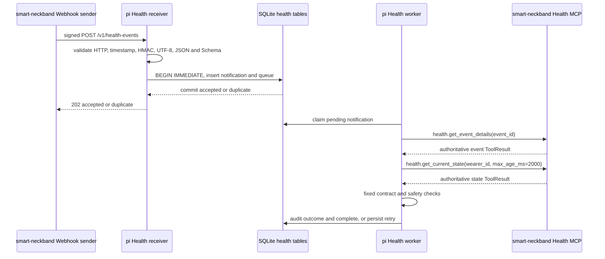

# Smart Collar Health MCP v0.2 双方实现核对与联调验收清单

> 文档日期：2026-07-24
>
> Health 契约版本：`0.2.0`
>
> MCP 协议版本：`2025-11-25`
>
> 我方仓库：`pi-hackason`
>
> 上游仓库：`smart-neckband`
>
> 文档用途：由 `pi-hackason` 接收消费端和 `smart-neckband` 生产服务端开发共同逐项核对。只有静态契约、双方实现和联合测试全部通过，才能判定 Health MCP v0.2 对接成功。

## 1. 核对结论定义

本文件把结论分为三类：

| 标记 | 含义 |
| --- | --- |
| `PI-已验证` | `pi-hackason` 当前工作区已有实现，并完成本文件记录的本地测试。 |
| `上游待确认` | 只能由 `smart-neckband` 开发核对其代码、配置或运行行为。 |
| `联调待验证` | 单边测试不能证明，需要双方进程同时运行并保留证据。 |

最终通过条件：

- [ ] 第 2 节三份输入文件的 SHA-256 在双方机器上一致。
- [ ] 第 5 至第 12 节没有未解决的契约差异。
- [ ] 第 13 节上游实现清单全部确认。
- [ ] 第 14 节联合测试用例全部通过。
- [ ] 第 15 节证据包完整。
- [ ] 第 16 节双方结论均为“通过”，且没有未关闭的阻断项。

任何单独一项测试通过，都不能替代上述整体结论。

## 2. 契约输入文件身份

双方应对原始附件执行 SHA-256。只有文件名和哈希都一致，才继续核对。

| 文件 | SHA-256 |
| --- | --- |
| `2026-07-23-health-mcp-spec-v0.2(1).md` | `A89142E08E8BA766D9DBCB2B4DAEA4CC4A8A22A1CFB1557AC98A25FEBE00937D` |
| `health-mcp-v0.2.contract(1).json` | `D9EC1619A14A0A7E38F2384C9B7F248B1D9EE3147DB9BD2AFF5C8DC8057F3626` |
| `Smart_Collar_Health_MCP_Spec_v0.2(1).md` | `E1D035EDE3040689AEB0F887EE79E0B35E76D3D80A062AC74566215AE60D5533` |

PowerShell 核对命令：

```powershell
Get-FileHash -Algorithm SHA256 -LiteralPath "<文件绝对路径>"
```

核对项：

- [ ] 上游开发确认三份文件哈希完全一致。
- [ ] 双方确认 `health-mcp-v0.2.contract(1).json` 是可执行机器契约，不以文档示例替代 Schema。
- [ ] 后续任何字段、枚举、范围或错误分类变更都升级契约版本，并同步机器契约、双方实现和测试向量。

## 3. 双方职责边界

### 3.1 `smart-neckband` 负责

- ECG、IMU、设备状态和语音数据的采集与解析。
- source instance、状态 revision、事件 revision 和 notification sequence 的持久化生成。
- `WearerState`、`WearerEvent` 和四类 P0 健康事件的确定性构建。
- SQLite Health 状态库、事件库、Webhook outbox、重试和 dead letter。
- Health MCP Server，默认 stdio transport。
- 签名 Health Webhook sender。
- 对外返回符合 `0.2.0` 机器契约的权威 event 和 current state。

### 3.2 `pi-hackason` 负责

- 独立的 `POST /v1/health-events` 接收端。
- raw-body HMAC、时间戳、Header、Content-Type、Content-Length 和 Schema 校验。
- notification 原子持久化、raw-body digest 幂等和 durable health queue。
- ACK 后通过 stdio 查询上游 Health MCP。
- 固定代码执行 wearer、source、revision、live/test 和 freshness 检查。
- 记录消费结果审计。
- 保证 Health v0.2 不进入普通 Agent FIFO，不调用 DimOS 或机器狗工具。

### 3.3 明确不在 v0.2 范围内

- 医疗诊断、医疗报警或急救联络。
- HRV、运动分类、姿态分类或位置推断。
- Health 事件到 `APPROACH`、前进、后退、导航、巡逻或其他物理动作的映射。
- 由 LLM 绕过固定安全门。
- 远程 Health MCP transport；P0 默认仅 stdio。
- 用 Webhook body 直接代替 MCP 权威查询结果。

## 4. 我方实现清单

我方 Health MCP v0.2 消费端实现位于 commit：

```text
b634bfcc696d5bf0cc71f24ee11272154b36edb8
feat(agent): add Health MCP v0.2 consumer with signed webhook
```

本核对文档自身是该 commit 之后新增的交接材料。上游核对实现时，应以完整 commit SHA 为准，不只按文件名或短 SHA 判断。

| 文件 | 责任 |
| --- | --- |
| `CONTEXT.md` | 新增 Health 通知、上游 Health MCP 术语和不变量，冻结独立队列、权威查询和无动作边界。 |
| `USAGE.md` | 新增用户可见的启用配置、默认命令、endpoint 和故障排查说明。 |
| `components/agent-framework/agent-webhook-gateway/README.md` | 新增组件级 Health 功能、配置和验证入口。 |
| `components/agent-framework/agent-webhook-gateway/src/cli.ts` | 启动和关闭 Health MCP、worker 和 receiver，并与普通 Agent service 共享同一 SQLite store。 |
| `components/agent-framework/agent-webhook-gateway/src/config.ts` | Health 默认关闭、密钥、wearer、MCP 命令和重试配置。 |
| `components/agent-framework/agent-webhook-gateway/src/health-contract.ts` | Webhook v0.2 Schema、MCP 结果安全字段解析、领域错误重试元数据。 |
| `components/agent-framework/agent-webhook-gateway/src/health-webhook.ts` | HTTP 验收顺序、raw-body HMAC、ACK、错误映射。 |
| `components/agent-framework/agent-webhook-gateway/src/health-mcp-client.ts` | MCP stdio JSON-RPC、initialize、结果一致性、超时和子进程重启。 |
| `components/agent-framework/agent-webhook-gateway/src/health-service.ts` | 独立队列 worker、权威状态查询、安全检查、审计和重试。 |
| `components/agent-framework/agent-webhook-gateway/src/store.ts` | Health notification、queue、event revision 和 audit 持久化。 |
| `components/agent-framework/agent-webhook-gateway/src/http-server.ts` | 将精确路径 `/v1/health-events` 路由至独立 receiver。 |
| `components/agent-framework/agent-webhook-gateway/src/index.ts` | 导出 Health contract、client、service 和 receiver 公共类型。 |
| `components/agent-framework/agent-webhook-gateway/test/config.test.ts` | 验证默认关闭、合法配置和缺失/非法 secret 的 fail-closed 行为。 |
| `components/agent-framework/agent-webhook-gateway/test/health-webhook.test.ts` | HMAC golden、ACK、错误顺序、并发幂等、冲突和可重试领域失败。 |
| `components/agent-framework/agent-webhook-gateway/test/health-mcp-client.test.ts` | initialize、并发调用、会话重启、TextContent 一致性和真实 stdio 子进程。 |
| `components/agent-framework/agent-webhook-gateway/test/support/fake-health-mcp.mjs` | 无硬件 stdio MCP 测试服务。 |
| `docs/agent-input-webhook-integration.md` | 明确普通 instruction Webhook 与 Health Webhook 是两个不同安全边界。 |
| `docs/health-mcp-consumer-integration.md` | 我方部署和使用指南。 |

`PI-已验证`：

- [x] Health endpoint、表、队列和 worker 与普通 Agent instruction/reply 路径分离。
- [x] Health MCP 客户端不复用机器狗 HTTP MCP wrapper。
- [x] 没有新增 Agent、DimOS 或机器狗动作调用。
- [x] 没有修改模型配置、DIMOS 配置或真实硬件配置。
- [x] 没有提交真实 secret。
- [x] 未配置 Health 变量时 endpoint 和 MCP 子进程保持关闭。
- [x] 任意部分 Health 配置或非法 secret 会在启动阶段 fail closed。

## 5. 端到端数据流



关键语义：

1. Webhook 是 at-least-once 唤醒通知，不是权威健康数据。
2. `202` 只表示 notification 已经 durable commit，不表示 MCP 查询完成。
3. worker 必须重新查询 event 和 current state。
4. Webhook ACK 不等待 MCP、LLM、DIMOS 或机器狗。
5. MCP 查询失败时不得使用旧健康数据替代。
6. v0.2 成功终态为 `verified_no_action`，明确表示没有物理动作。

核对项：

- [ ] 上游 sender 不把 `202` 解释为健康判断或动作完成。
- [ ] 上游 MCP 查询结果来自与事件/状态 writer 一致的权威 Health 状态库。
- [ ] 双方都不把 Webhook body 当成当前完整状态。

## 6. 我方启动配置

Health 默认关闭。只要存在任意 `AGENT_WEBHOOK_HEALTH_*` 环境变量，就进入 Health 配置校验；必填项缺失或非法时进程在监听端口和启动子进程前失败。

| 环境变量 | 必填 | 默认值 | 当前行为 |
| --- | --- | --- | --- |
| `AGENT_WEBHOOK_HEALTH_WEARER_ID` | 启用时必填 | 无 | 必须匹配 `[A-Za-z0-9][A-Za-z0-9._-]{0,63}`。 |
| `AGENT_WEBHOOK_HEALTH_KEY_ID` | 启用时必填 | 无 | 当前 HMAC key ID，不能为空。 |
| `AGENT_WEBHOOK_HEALTH_SECRET_HEX` | 启用时必填 | 无 | 必须是 64 位 lowercase hex，解码后恰好 32 bytes。 |
| `AGENT_WEBHOOK_HEALTH_PREVIOUS_KEY_ID` | 可选 | 无 | 轮换期前一 key ID，必须与 previous secret 同时配置。 |
| `AGENT_WEBHOOK_HEALTH_PREVIOUS_SECRET_HEX` | 可选 | 无 | 同样必须是 64 位 lowercase hex。 |
| `AGENT_WEBHOOK_HEALTH_MCP_COMMAND` | 可选 | `py` | 直接 spawn，不经过 shell。 |
| `AGENT_WEBHOOK_HEALTH_MCP_ARGS_JSON` | 可选 | 见下文 | 必须是 JSON string array。 |
| `AGENT_WEBHOOK_HEALTH_MCP_TIMEOUT_MS` | 可选 | `10000` | initialize 和单次 request 超时。 |
| `AGENT_WEBHOOK_HEALTH_RETRY_BASE_MS` | 可选 | `1000` | 本地指数退避基数。 |
| `AGENT_WEBHOOK_HEALTH_RETRY_MAX_MS` | 可选 | `60000` | 本地指数退避上限；合法 `retry_after_ms` 可以延长等待。 |

默认 MCP 启动命令：

```text
py -3.12 -m smart_neckband.health_mcp --transport stdio
```

等价参数配置：

```powershell
$env:AGENT_WEBHOOK_HEALTH_MCP_COMMAND = "py"
$env:AGENT_WEBHOOK_HEALTH_MCP_ARGS_JSON = '["-3.12","-m","smart_neckband.health_mcp","--transport","stdio"]'
```

上游必须反馈：

- [ ] 上述默认 module path 是否正确。
- [ ] 上游要求的 Python 版本是否为 `3.12`。
- [ ] MCP 子进程从哪个工作目录启动均能正确定位状态库和配置。
- [ ] 若默认命令不正确，提供生产命令和参数数组，不提供需要 shell 拼接的命令字符串。
- [ ] 上游明确 Health DB 路径和 wearer 配置的传递方式。
- [ ] 上游 stderr 不输出 secret、完整签名、完整 Webhook body 或敏感健康原始数据；我方会把子进程 stderr 转发到自身 stderr。

## 7. Health Webhook HTTP 契约

### 7.1 Endpoint

```http
POST /v1/health-events
```

只有启用 Health 配置时该 endpoint 才存在。未启用时返回普通 `404`。

### 7.2 必需 Header

| Header | 要求 |
| --- | --- |
| `Content-Type` | 只接受 `application/json` 或 `application/json; charset=utf-8`。参数名和值大小写不敏感，分号和等号周围允许 OWS；拒绝其他 charset、其他参数或多个参数。 |
| `Content-Length` | 必须存在，只允许十进制数字，范围 `1..65536`。 |
| `X-Smart-Collar-Key-Id` | 必须匹配当前或前一个已配置 key ID。 |
| `X-Smart-Collar-Timestamp` | 必须匹配 `^[1-9][0-9]{0,11}$`，范围 `1..253402300799`，并处于接收端当前 UTC 的 `±300` 秒内。 |
| `X-Smart-Collar-Notification-Id` | 必须与解析后 body 的 `notification_id` 逐字符相等。 |
| `X-Smart-Collar-Signature` | 必须匹配 `^v1=([0-9a-f]{64})$`。 |

`Accept` 和 `User-Agent` 不是 receiver 必需 Header。

限制：

- 不接受 chunked transfer。
- 声明或实际 body 超过 65536 bytes 均拒绝。
- HMAC 校验发生在 UTF-8 decode、JSON parse 和 Schema 校验之前。
- 任何失败响应都不回显 secret、签名、raw body、解析结果或内部异常。

### 7.3 固定验证顺序

接收端严格按下列顺序执行：

1. HTTP method。
2. 精确 path。
3. Content-Type。
4. Content-Length、禁止 chunked 和 body size。
5. 读取 raw body，并核对实际长度。
6. timestamp 语法、范围和 `±300` 秒。
7. key ID、signature 语法和 raw-body HMAC。
8. fatal UTF-8 decode。
9. JSON parse。
10. `WebhookRequest` Schema。
11. Header notification ID 与 body notification ID。
12. notification digest、原子持久化和幂等分类。
13. 返回 ACK。

上游应使用此顺序判断失败原因，不要假设 receiver 会先解析 JSON。

### 7.4 HMAC 算法

部署 secret：

```text
secret_bytes = hex_decode(SMART_COLLAR_HEALTH_WEBHOOK_SECRET_HEX)
```

签名输入：

```text
ascii(timestamp) + "." + raw_request_body_bytes
```

签名：

```text
v1=lowercase_hex(HMAC-SHA256(secret_bytes, signing_input))
```

要求：

- secret 恰好 32 bytes。
- body 必须使用实际发送的原始 UTF-8 bytes。
- 不得 parse 后重新序列化再签名。
- timestamp 后的点号是 ASCII `0x2e`。
- 接收端使用 constant-time 比较。
- key rotation 时当前和前一个 key 都可以验签，但两个 key ID 必须不同。

### 7.5 Webhook body 字段

所有字段均 required，根对象 `additionalProperties: false`。

| 字段 | 类型与约束 |
| --- | --- |
| `schema_version` | 固定 `"0.2.0"`。 |
| `notification_id` | lowercase UUID。 |
| `notification_sequence` | `0..9007199254740991` 的整数。 |
| `event_id` | lowercase UUID。 |
| `event_revision` | `1..9007199254740991` 的整数。 |
| `transition` | `"opened"` 或 `"resolved"`。 |
| `event_type` | `"lead_off"`、`"adc_clipping"`、`"input_stale"` 或 `"input_offline"`。 |
| `wearer_id` | 1 至 64 字符，匹配 `[A-Za-z0-9][A-Za-z0-9._-]{0,63}`。 |
| `source_instance_id` | lowercase UUID。 |
| `state_revision` | `0..9007199254740991` 的整数。 |
| `data_source` | `"live"`、`"replay"` 或 `"synthetic"`。 |
| `occurred_at` | 严格 RFC3339 millisecond UTC，例如 `2026-07-23T02:10:03.000Z`。 |
| `sent_at` | 同上。 |
| `trace_id` | lowercase UUID。 |
| `test_mode` | boolean。 |

额外语义：

- `data_source` 为 `replay` 或 `synthetic` 时，`test_mode` 必须为 `true`。
- 我方 worker 只允许 `data_source=live` 且 `test_mode=false` 进入权威状态查询后的成功检查。
- 非 live/test notification 可以 durable ACK，但最终只记录 `unsafe_event_source`，不会执行动作。

### 7.6 ACK 和错误矩阵

| 条件 | HTTP | JSON body |
| --- | ---: | --- |
| 新 notification durable commit | `202` | `{"notification_id":"<uuid>","status":"accepted"}` |
| 同 ID、同 raw-body SHA-256 | `202` | `{"notification_id":"<uuid>","status":"duplicate"}` |
| method 不是 POST | `405` | `{"error":"method_not_allowed"}`，同时 `Allow: POST` |
| path 错误 | `404` | `{"error":"not_found"}` |
| Content-Type 错误 | `415` | `{"error":"unsupported_media_type"}` |
| Content-Length 缺失、非法、为 0，或 chunked | `400` | `{"error":"invalid_request"}` |
| 声明或实际 body 超过 65536 bytes | `413` | `{"error":"body_too_large"}` |
| timestamp 缺失、非法、越界或过期 | `401` | `{"error":"timestamp_out_of_range"}` |
| key/signature 缺失或 HMAC 不匹配 | `401` | `{"error":"invalid_signature"}` |
| 非 UTF-8、非法 JSON 或 Schema 失败 | `400` | `{"error":"invalid_request"}` |
| Header/body notification ID 不一致 | `400` | `{"error":"invalid_request"}` |
| 同 ID、不同 raw-body SHA-256 | `409` | `{"error":"notification_id_conflict"}` |
| 持久化或幂等 transaction 失败 | `503` | `{"error":"internal_error"}` |

上游 sender 分类必须与原始 v0.2 契约一致：

- `202 accepted|duplicate`：成功。
- `408`、`425`、`429`、`5xx`、连接错误、TLS 错误、timeout 或无效 ACK：retryable。
- 其他 `4xx`：terminal。
- `409`：terminal，并产生数据完整性告警。
- `3xx`：terminal，不跟随 redirect，不转发签名 Header 或 body。
- 其他不符合契约的 `2xx`：terminal，不能当成功。

## 8. 原子幂等和持久化语义

我方使用同一 SQLite 数据库中的独立 Health 表：

| 表 | 用途 |
| --- | --- |
| `health_notifications` | 保存 notification 标识、顺序、event、wearer、raw-body SHA-256、原始 body 和接收时间。 |
| `health_queue` | 保存 `pending/processing/completed`、attempts、next attempt、processed time 和 outcome。 |
| `health_event_revisions` | 保存每个 event 已处理的最高 revision。 |
| `health_audit` | 保存 notification、event、revision、outcome、detail 和处理时间。 |

受理 transaction：

```text
BEGIN IMMEDIATE
INSERT health_notifications ... ON CONFLICT DO NOTHING
if inserted:
  INSERT health_queue ... status=pending
  COMMIT
  return accepted
else:
  compare persisted raw_body_sha256
  COMMIT
  return duplicate or conflict
```

`PI-已验证`：

- [x] notification insert 和 queue insert 在同一 transaction。
- [x] 并发 5 次发送同一 ID/同一 body 时，恰好一个 `accepted`，其余为 `duplicate`。
- [x] 同 ID/不同 raw body 返回 `409`。
- [x] duplicate 不重复入队、不重复查询 MCP。
- [x] 进程启动时把遗留 `processing` 恢复为 `pending`。
- [x] MCP transport 失败把 item 持久化恢复为 `pending`，并增加 attempts。
- [x] event revision 已处理时记录 `obsolete_notification`，不重复执行业务检查。

需要联合确认：

- [ ] 上游重试逐字节复用首次 durable 保存的 body，只更新签名 Header timestamp 和 HMAC。
- [ ] 上游进程在发送后、收到 ACK 前被杀死，重启后重发相同 notification ID 和相同 body。
- [ ] 上游不因 `duplicate` 再创建新的 notification ID。
- [ ] 上游 `notification_sequence` 按 wearer 持久化递增。

## 9. Health MCP stdio wire 契约

### 9.1 进程边界

我方使用：

```text
spawn(command, args, shell=false)
```

要求：

- stdout 只能输出一行一个 UTF-8 JSON-RPC 消息。
- 日志只能输出到 stderr。
- 不允许 stdout banner、日志前缀、空白说明或非 JSON 文本。
- MCP 进程退出时，当前请求失败并进入 durable retry。
- 下一次启动新子进程会重新执行 initialize；不会把旧进程的初始化状态复用给新进程。

### 9.2 初始化

客户端每个 stdio 子进程会话只初始化一次：

```json
{
  "jsonrpc": "2.0",
  "id": 1,
  "method": "initialize",
  "params": {
    "protocolVersion": "2025-11-25",
    "capabilities": {},
    "clientInfo": {
      "name": "pi-health-consumer",
      "version": "0.2.0"
    }
  }
}
```

服务端必须返回：

- `protocolVersion` 精确为 `2025-11-25`。
- `capabilities` 为 JSON object。
- `serverInfo` 为 JSON object。

随后客户端发送：

```json
{
  "jsonrpc": "2.0",
  "method": "notifications/initialized",
  "params": {}
}
```

核对项：

- [ ] 上游支持协议 `2025-11-25`。
- [ ] initialize 前不要求 tools/call。
- [ ] initialized notification 不返回 JSON-RPC response。
- [ ] 同一进程第二次 tools/call 前不要求重复 initialize。
- [ ] 新进程会话接受重新 initialize。

### 9.3 固定工具调用顺序

每个首次入队并且不是 obsolete、unsupported wearer 或非 live/test 的 notification，依次调用：

```json
{
  "name": "health.get_event_details",
  "arguments": {
    "event_id": "<notification.event_id>"
  }
}
```

然后：

```json
{
  "name": "health.get_current_state",
  "arguments": {
    "wearer_id": "<notification.wearer_id>",
    "max_age_ms": 2000
  }
}
```

第二个调用只在第一个调用产生可解析的成功 event 后执行。

### 9.4 tools/call 结果

每个工具结果必须同时包含：

- `content`，数组长度恰好为 1。
- 唯一元素为 `{ "type": "text", "text": "<JSON string>" }`。
- `structuredContent`，JSON object。
- `isError`，boolean。

我方会：

1. JSON.parse `content[0].text`。
2. 对解析结果与 `structuredContent` 执行深度相等比较。
3. 任一不一致都记录 `invalid_mcp_result`，不使用结果。

成功：

- `isError=false`。
- `structuredContent.ok=true`。
- `data.event` 或 `data.state` 存在。

领域失败：

- `isError=true`。
- `structuredContent.ok=false`。
- `structuredContent.error.retryable` 必须准确。
- `retryable=true` 时，我方重新持久化排队。
- 有合法 `retry_after_ms` 时，实际等待取本地指数退避与 `retry_after_ms` 的较大值。
- `retryable=false` 时，本次 notification 记录 `invalid_mcp_result` 并完成，不原样重试。

JSON-RPC error、非法协议版本、缺 result、非法 JSON、TextContent 不一致或结果结构不兼容均视为协议/契约失败，不作为临时领域错误无限重试。

## 10. 权威 event 和 state 固定检查

### 10.1 Event 最低读取字段

`health.get_event_details` 成功结果中的 `data.event` 至少必须满足：

| 字段 | 我方要求 |
| --- | --- |
| `schema_version` | `"0.2.0"` |
| `event_id` | 与 notification `event_id` 相同 |
| `event_revision` | 大于等于 notification `event_revision` |
| `event_type` | 与 notification `event_type` 相同 |
| `wearer_id` | 与 notification 和配置 wearer 相同 |
| `source_instance_id` | 与 notification 相同 |
| `data_source` | `"live"` |
| `test_mode` | `false` |

不满足时：

- event 标识、revision、type、wearer 或 source 不一致：`event_mismatch`。
- event 非 live 或 test：`unsafe_event_source`。
- Schema 或结果 envelope 无效：`invalid_mcp_result`。

### 10.2 Current state 最低读取字段

`health.get_current_state` 成功结果中的 `data.state` 至少必须满足：

| 字段 | 我方要求 |
| --- | --- |
| `schema_version` | `"0.2.0"` |
| `wearer_id` | 与 notification 相同 |
| `state_revision` | 大于等于 notification `state_revision` |
| `source_instance_id` | 与 notification 相同 |
| `data_source` | `"live"` |
| `freshness` | `"fresh"` |
| `test_mode` | `false` |

不满足时：

- 字段结构不合法：`invalid_mcp_result`。
- wearer、source、state revision、live/test 或 freshness 不满足：`unsafe_state`。

### 10.3 消费结果

| outcome | 含义 | 是否调用物理动作 |
| --- | --- | ---: |
| `verified_no_action` | event 和 state 通过全部固定检查并完成审计 | 否 |
| `obsolete_notification` | 同 event revision 已经处理或存在更高 revision | 否 |
| `unsupported_wearer` | notification wearer 不是配置 wearer | 否 |
| `event_mismatch` | 权威 event 与 notification 不一致 | 否 |
| `unsafe_event_source` | notification 或 event 非 live/test | 否 |
| `unsafe_state` | 权威 state 不满足 wearer/source/revision/live/test/freshness | 否 |
| `invalid_mcp_result` | MCP 领域终态失败或 wire/Schema 不兼容 | 否 |

`verified_no_action` 不表示：

- wearer 健康正常。
- 系统给出医疗判断。
- 已向用户报警。
- 已触发机器人动作。
- 上游所有传感器和事件算法均已验证。

## 11. 重试、重启和错误恢复

我方可重试条件：

- MCP 子进程无法启动或意外退出。
- 请求写入失败。
- request timeout。
- 初始化过程中 transport session 改变。
- Health MCP 领域失败明确给出 `retryable=true`。

我方终态条件：

- 合法领域失败但 `retryable=false`。
- MCP wire 或结果契约无效。
- 权威 event/state 安全字段不满足。
- notification 已经 obsolete。

退避：

```text
local_delay = min(retry_base_ms * 2^attempts, retry_max_ms)
actual_delay = max(local_delay, valid_retry_after_ms)
```

Node timer 安全上限为 `2147483647 ms`。

重启：

- 启动时，`health_queue.status=processing` 的 item 恢复为 `pending`。
- pending item 保留 attempts 和 next attempt。
- 新 stdio 子进程重新 initialize。
- duplicate Webhook 不会创建第二个 queue item。

当前我方没有为消费队列设置 dead letter 或最大尝试次数。持续的 transport/`retryable=true` 失败会保留并继续重试。若双方希望增加消费端 dead letter，必须作为单独需求冻结，不在本次 v0.2 实现中临时加入。

## 12. 安全与部署约束

### 12.1 必须保持

- Health secret 不与普通 Agent、MCP、Live Web 或其他 token 共用。
- secret 不写入 Git，不打印，不出现在错误响应。
- 非 loopback Webhook 部署必须在受控网络和 TLS 终止后使用。
- 反向代理不得修改 raw body，不得改为 chunked，不得移除 Content-Length。
- 双方主机时间需可靠同步；偏差超过 300 秒会被拒绝。
- Health MCP 默认同机 stdio，不暴露 LAN HTTP。
- 上游 replay/synthetic 数据永远不能伪装为 live。
- Health 结果不得进入 LLM 后绕过固定检查。

### 12.2 v0.2 动作边界

我方 Health worker 没有 Agent、DimOS 或 robot client 依赖。即使 event/state 完全通过，也只写 `verified_no_action` 审计。

联合测试期间：

- 不连接真实机器狗。
- 不启动 DIMOS。
- 不修改模型配置。
- 不使用真实人体或医疗数据。
- 优先使用 synthetic/bench 数据和临时 SQLite。

## 13. 上游开发静态核对清单

请 `smart-neckband` 开发逐项填写“是/否/不适用”，并为“是”提供文件路径、符号名或测试名。

### 13.1 版本和 Schema

- [ ] Health contract 精确为 `0.2.0`。
- [ ] MCP protocol 精确为 `2025-11-25`。
- [ ] Python MCP SDK 版本已精确锁定。
- [ ] tools/list 暴露四个 P0 tool 的 input/output Schema。
- [ ] 所有 output 和 Webhook body 通过 `health-mcp-v0.2.contract(1).json`。
- [ ] `additionalProperties: false` 没有被框架静默放宽。
- [ ] timestamp、UUID、safe integer 和 nullable 语义与机器契约一致。

### 13.2 状态和事件

- [ ] 单 wearer 配置明确，未知 wearer 返回 `WEARER_NOT_FOUND`，不泄漏 wearer 列表。
- [ ] `source_instance_id` 在 reader/端口/应用重启和确认设备时间回退时正确旋转。
- [ ] state revision、event revision、notification sequence 由 SQLite 持久化。
- [ ] event 和对应 state revision 在同一 transaction。
- [ ] 只有 status/voice、从未收到有效 ECG 时，不创建 Health event/outbox。
- [ ] 四类 P0 event 的打开、维持、解除、迟滞和复合 transition 均有边界测试。
- [ ] `input_stale -> input_offline` 的两个 notification 顺序和共享 state revision 符合 v0.2。
- [ ] 非 ECG 流量不能使旧 ECG 重新 fresh。
- [ ] replay/synthetic 强制 `test_mode=true`。

### 13.3 MCP Server

- [ ] 默认入口可由 `py -3.12 -m smart_neckband.health_mcp --transport stdio` 启动，或已提供替代命令。
- [ ] stdout 只输出 newline-delimited JSON-RPC。
- [ ] stderr 日志无 secret、完整 body 和敏感原始数据。
- [ ] initialize/initialized 生命周期正确。
- [ ] `health.get_event_details` 返回 notification 引用 event 的当前或更高 revision。
- [ ] `health.get_current_state(max_age_ms=2000)` 只能收紧 freshness，不能把 stale/offline 放宽为 fresh。
- [ ] `content[0].text` JSON 与 `structuredContent` 深度相等。
- [ ] 成功 `isError=false`，领域失败 `isError=true`。
- [ ] JSON-RPC error 和 tool execution error 分类与 v0.2 一致。
- [ ] `retryable` 和 `retry_after_ms` 与错误码表一致。

### 13.4 Webhook sender

- [ ] secret 配置只接受 64 位 lowercase hex，解码后恰好 32 bytes。
- [ ] 签名使用实际发送的 raw body bytes。
- [ ] 发送 Header 名称、timestamp 格式和 signature 语法完全一致。
- [ ] body 所有字段 required，无额外字段。
- [ ] 首次 raw body durable 保存，重试逐字节复用。
- [ ] 当前/前一个 key rotation 行为有测试。
- [ ] 关闭所有 HTTP redirect 自动跟随。
- [ ] ACK JSON 被严格校验，其他 `2xx` 不被当成功。
- [ ] retryable/terminal HTTP 分类正确。
- [ ] 进程 kill/restart 后 pending outbox 恢复。
- [ ] 超过上游定义周期后进入 dead letter，且有可观测性。

### 13.5 上游反馈表

| 项目 | 上游填写 |
| --- | --- |
| 仓库 URL/路径 |  |
| commit SHA |  |
| Python 版本 |  |
| MCP SDK 及锁定版本 |  |
| MCP 启动命令 |  |
| Health DB 路径 |  |
| wearer ID |  |
| Webhook sender 配置位置 |  |
| 当前 key ID |  |
| 前一个 key ID，若有 |  |
| 单元测试命令 |  |
| 契约测试命令 |  |
| 已知限制 |  |

不要在反馈表中填写 secret。

## 14. 双方联合测试计划

### 14.1 联调环境

建议配置：

- 同一台开发 PC。
- 临时 Health SQLite 和临时 Gateway SQLite。
- loopback HTTP。
- synthetic/bench 数据。
- 专用测试 key ID 和随机 32-byte test secret。
- 不启动 Agent 模型、DIMOS 或真实机器狗。

双方记录：

| 项目 | 值 |
| --- | --- |
| 日期和时区 |  |
| `pi-hackason` commit/diff 标识 |  |
| `smart-neckband` commit |  |
| Node.js 版本 |  |
| Python 版本 |  |
| Health MCP SDK 版本 |  |
| wearer ID |  |
| source instance ID |  |
| test key ID |  |
| Gateway URL |  |
| Health DB 临时路径 |  |
| Gateway DB 临时路径 |  |

### 14.2 Golden HMAC

以下 secret 是上游机器契约的公开测试向量，只能用于测试：

```text
secret_hex = 000102030405060708090a0b0c0d0e0f101112131415161718191a1b1c1d1e1f
timestamp = 1784772600
```

raw body 必须是以下单行 UTF-8 bytes，不带 BOM，不追加换行：

```json
{"schema_version":"0.2.0","notification_id":"894d7ebf-3c7a-4818-a85d-3555a0d4dd13","notification_sequence":431,"event_id":"50d40557-8df6-47b5-abce-1ef447bf5543","event_revision":2,"transition":"resolved","event_type":"lead_off","wearer_id":"xwen","source_instance_id":"ef132c67-a98f-474a-a673-4ab6ea784790","state_revision":1849,"data_source":"live","occurred_at":"2026-07-23T02:10:03.000Z","sent_at":"2026-07-23T02:10:03.120Z","trace_id":"7a916c4a-3b3e-4ec5-8491-e5fc7e843863","test_mode":false}
```

预期 signature：

```text
v1=217d52203ca73e60f36a9f6c323e34023e22a00d3db74af92522ae6d5c974067
```

注意：联调真实 HTTP 时 timestamp 必须在接收端当前时间 `±300` 秒内，因此该历史 golden 用于离线算法测试；实时发送时用当前 timestamp 重新计算 HMAC。

### 14.3 联调用例

| ID | 场景 | 操作 | 预期 |
| --- | --- | --- | --- |
| `INT-001` | MCP initialize | 启动 Gateway，并触发首个 Health 查询 | 上游收到一次 initialize 和 initialized，协议为 `2025-11-25`。 |
| `INT-002` | live happy path | 生成 live、非 test、fresh event/state，发送签名 notification | HTTP `202 accepted`；MCP 依次收到 event/state 查询；我方审计 `verified_no_action`。 |
| `INT-003` | duplicate | 原样重发 `INT-002` 的 ID 和 raw body | HTTP `202 duplicate`；不新增 queue item；不重复查询 MCP。 |
| `INT-004` | raw-body conflict | 同 notification ID 修改任一 body byte并重签 | HTTP `409 notification_id_conflict`。 |
| `INT-005` | wrong signature | 使用错误 key 或 signature | HTTP `401 invalid_signature`；不解析为有效 notification，不入库。 |
| `INT-006` | expired timestamp | 使用超过 `±300` 秒的 timestamp | HTTP `401 timestamp_out_of_range`。 |
| `INT-007` | Header/body ID mismatch | 正确签名，但 Header notification ID 不同 | HTTP `400 invalid_request`。 |
| `INT-008` | Schema rejection | 添加额外字段或使用未知 event type并正确重签 | HTTP `400 invalid_request`。 |
| `INT-009` | replay source | 发送 `data_source=replay,test_mode=true` | durable ACK；不查询 MCP；审计 `unsafe_event_source`；无动作。 |
| `INT-010` | event mismatch | MCP event source/revision/wearer/type 与 notification 不一致 | 审计 `event_mismatch` 或 `unsafe_event_source`；不使用 state 驱动动作。 |
| `INT-011` | stale state retry | current state 返回 `STATE_STALE,retryable=true,retry_after_ms=<N>` | queue 恢复 pending；等待不少于本地退避和 N 的较大值；不使用旧 state。 |
| `INT-012` | non-retryable domain failure | 返回 `EVENT_NOT_FOUND,retryable=false` | 审计 `invalid_mcp_result`，该 notification 不原样无限重试。 |
| `INT-013` | MCP process restart | 第一次查询中杀死 MCP 子进程 | item 保留并重试；新进程先重新 initialize，再 tools/call。 |
| `INT-014` | Gateway restart | notification 已 commit 后、处理完成前杀死 Gateway | sender 重发得到 duplicate；Gateway 重启后恢复 queue 并完成一次处理。 |
| `INT-015` | sender restart before ACK | sender 已发出请求但未保存 ACK 时杀死 sender | sender 重启后用相同 ID 和 raw body 重发，得到 accepted 或 duplicate。 |
| `INT-016` | concurrent delivery | 并发发送 5 个相同 ID/body | 恰好一个 accepted，其余 duplicate，queue 恰好一条。 |
| `INT-017` | current/previous key | 分别使用当前和前一个 key | 轮换窗口内均通过；未知 key 拒绝。 |
| `INT-018` | stdout contamination | MCP stdout 写入非 JSON 日志 | 我方拒绝协议结果；上游修复为 stderr 日志。 |
| `INT-019` | TextContent mismatch | `content[0].text` 与 `structuredContent` 不同 | 审计 `invalid_mcp_result`；不使用结果。 |
| `INT-020` | no physical action | 完成所有成功和失败场景 | Agent run count、DIMOS call count、robot tool call count 均为 0。 |

### 14.4 每个用例必须保存的证据

- sender 侧 notification ID、event ID、revision、HTTP status 和分类，不包含 secret/完整签名。
- receiver 侧 ACK body。
- 上游 MCP request method、tool name、参数和结果错误码，不记录敏感原始数据。
- `health_queue` 最终 status、attempts 和 outcome。
- `health_audit` 对应 outcome。
- 进程 kill/restart 用例的时间线。
- Agent、DIMOS、robot 调用次数为 0 的断言。

## 15. 我方本地验证证据

环境：

```text
Windows
Node.js v24.18.0
npm 11.16.0
```

已执行：

```powershell
Set-Location "E:/Documents/GitHub/pi-hackason/components/agent-framework/agent-webhook-gateway"
npm.cmd run check
npm.cmd test
npm.cmd run demo:dry-run

Set-Location "E:/Documents/GitHub/pi-hackason"
git diff --check
npm.cmd run check
```

结果：

| 检查 | 结果 |
| --- | --- |
| Gateway TypeScript check | 通过 |
| Gateway tests | 通过，7 个 test files，28 个 tests |
| Gateway no-hardware dry-run | 通过 |
| dry-run Agent runs | 1，属于普通 instruction 测试，不是 Health 触发 |
| dry-run wrapper calls | `move_forward`、`stop_all` 各一次 |
| dry-run dog calls | `move_forward`、`stop_all` 各一次 |
| Health 触发 Agent/DIMOS/robot | 0 |
| `git diff --check` | 通过 |
| 根级 Biome | 通过 |
| pinned deps、TS imports、shrinkwrap、install lock | 通过 |
| 根级 `tsgo --noEmit` | 未通过；阻塞在 `packages/ai`、`packages/agent`、`packages/coding-agent` 的模型目录 `unknown/never` 类型错误，报错文件不在本次 Health 改动范围 |

根级 `tsgo` 的这些错误不能被描述为本次功能通过，但也不能被误归因于 Health Gateway。联合验收应以 Gateway 局部检查、专项测试和联合场景证据为主，同时单独跟踪根级类型基线问题。

## 16. 差异登记和双方签字

### 16.1 契约差异登记

发现差异时不要口头约定后继续。填写下表，并决定：

1. 修正某一方实现以符合 `0.2.0`；或
2. 修改机器契约并升级版本；或
3. 明确判定为非阻断的文档澄清。

| 差异 ID | 发现方 | 契约条款 | 实际行为 | 风险 | 责任方 | 处理方案 | 状态 |
| --- | --- | --- | --- | --- | --- | --- | --- |
|  |  |  |  |  |  |  |  |

禁止：

- 只改示例，不改机器契约。
- 双方各自容忍不同字段。
- 把未知枚举映射为已有值。
- 临时放宽 Schema 后不升级版本。
- 为了联调通过而跳过 HMAC、freshness、live/test 或 revision 检查。

### 16.2 `smart-neckband` 开发结论

```text
核对人：
仓库和 commit：
核对日期：
静态契约：通过 / 不通过
上游单元和契约测试：通过 / 不通过
联合测试 INT-001..INT-020：通过 / 不通过
未关闭差异：
最终结论：通过 / 有条件通过 / 不通过
```

### 16.3 `pi-hackason` 开发结论

```text
核对人：
仓库和 commit/diff：
核对日期：
接收端专项测试：通过 / 不通过
安全边界：通过 / 不通过
联合测试 INT-001..INT-020：通过 / 不通过
未关闭差异：
最终结论：通过 / 有条件通过 / 不通过
```

### 16.4 最终放行规则

只有同时满足以下条件才写“对接成功”：

- 双方基于相同的三份输入文件。
- 上游静态清单全部完成。
- `INT-001` 至 `INT-020` 全部通过。
- 所有阻断差异关闭。
- Health 触发的 Agent、DIMOS 和 robot 调用数为 0。
- 双方分别给出“通过”结论。

在此之前，准确表述应为：

```text
pi-hackason Health MCP v0.2 消费端已实现并完成本地专项验证；
smart-neckband 生产端实现和双方联合验收尚待确认。
```
