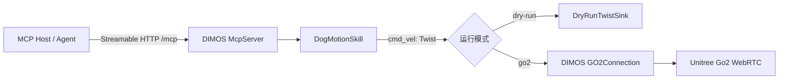

# DIMOS 机器狗 MCP MVP

这是一个基于 DIMOS 原生模块、`@skill` 和 HTTP MCP Server 的最小机器狗控制扩展。它没有另起一套机器人协议：运动技能发布 DIMOS 标准 `cmd_vel: Twist`，由 DIMOS 的连接模块消费。

默认模式是 `dry-run`：不连接、站立或移动真实机器狗。只有显式设置 `DIMOS_DOG_MCP_MODE=go2` 后，才会装配 DIMOS 官方的 `GO2Connection`。



## 安装

DIMOS 官方 Go2 路径要求 Python 3.12、已完成的 Go2 网络配置。基础包只安装启动 MCP 所需的 DIMOS `base` extra；Go2 驱动是显式可选依赖。

```bash
uv venv --python 3.12
source .venv/bin/activate
uv pip install -e /absolute/path/to/pi-hackason/integrations/dimos-dog-mcp
```

## 启动和连接 MCP

先以默认 dry-run 启动，确认 MCP 工具和参数无误：

```bash
dimos-dog-mcp
```

DIMOS 的 MCP Server 默认监听 `http://localhost:9990/mcp`。例如 Claude Code 可这样接入：

```bash
claude mcp add --transport http --scope project dimos-dog http://localhost:9990/mcp
```

服务暴露四个原生 DIMOS 工具：

| 工具 | 参数 | 行为 |
| --- | --- | --- |
| `move_forward` | `speed_mps`、`duration_s` | 启动短时前进，到期后发送零速度 |
| `move_backward` | `speed_mps`、`duration_s` | 启动短时后退，到期后发送零速度 |
| `stop_motion` | 无 | 取消本地运动并立即发布零速度 |
| `motion_status` | 无 | 返回本地命令状态，不是机器狗遥测 |

速度范围固定为 `0.01–0.20 m/s`，持续时间固定为 `0.1–2.0 s`；默认值是 `0.10 m/s`、`1.0 s`。前进/后退调用会立即返回“已启动”，运动状态机在后台以 10 Hz 发布命令并拒绝重叠动作；`stop_motion` 会抢占当前动作。

## 启用真实 Go2

仅在完成场地隔离、急停可用、低延迟网络和官方 Go2 预检后执行：

```bash
export ROBOT_IP=<YOUR_GO2_IP>
export DIMOS_DOG_MCP_MODE=go2
uv pip install -e '/absolute/path/to/pi-hackason/integrations/dimos-dog-mcp[go2]'
dimos-dog-mcp
```

真实模式复用 DIMOS 官方 `GO2Connection`，其通过 WebRTC 与 Unitree Go2 通信。每个成功、停止或模块关闭的运动路径都会发布零 `cmd_vel`。MCP 客户端断开并不等同于 DIMOS 的运动取消，因此本 MVP 以 2 秒硬上限作为故障边界；需要提前停止时必须调用 `stop_motion`。

对于非 Go2 机器狗，不要设置 `DIMOS_DOG_MCP_MODE=go2`。可以在 `blueprint.py` 中把 `GO2Connection.blueprint()` 换成该设备的 DIMOS 模块，只要它消费同名、同类型的 `cmd_vel: Twist` 输入流。

## 测试

核心运动状态机不依赖 DIMOS，因此可在任何 Python 3.10+ 环境中验证：

```powershell
Set-Location "/absolute/path/to/pi-hackason/integrations/dimos-dog-mcp"
$env:PYTHONPATH = "$PWD/src"
python -m unittest discover -s tests -v
```
